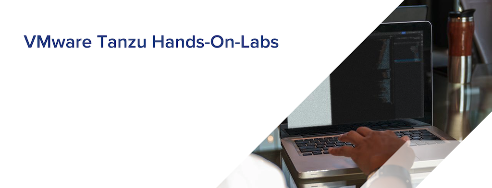

# TKGm-HOL
 (VMware Tanzu Kubernetes Grid - vSphere with Tanzu(TKGm) Hands-On-Lab)
 

 ## Introduction
본 핸즈온 문서는 VMWare Tanzu Kubernetes Grid 에 대한 전반적인 내용과 실습을 위한 가이드 문서입니다. 본 과정에서는 Tanzu Kubernetes Grid의 제품에 대한 소개와 실습을 포함하고 있습니다.

## Objectives
*

## Required Artifacts
* 인터넷 접속 가능한 PC
* vSphere 7 with Tanzu
* SSH Terminal (windows Putty, macOS Terminal 등)

## Hands-On 순서

1. [Tanzu Portfolio 소개](./TanzuPortfolio_overview.md)
2. [vSphere with Tanzu Hands-On-Lab](./tkgm_HOL.md)
