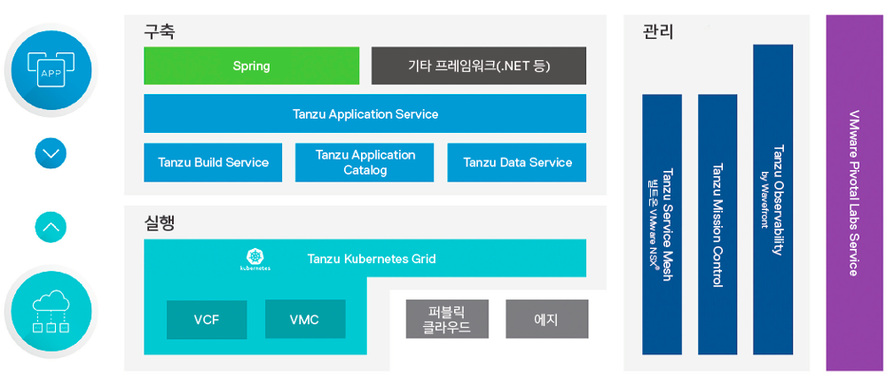

    이하 매뉴얼의 내용은 독자가 쿠버네티스(Kubernetes)에 대한 기본적인 이해가 있는 것을 전제하고 작성되었습니다. 
    일반 쿠버네티스 환경에 대한 개념 등은 설명하지 않으므로, 사전에 관련 내용을 숙지하고 본 매뉴얼을 활용할 것을 권장 드립니다.

## Tanzu 및 TKG개념 소개
### 개요 및 개념
#### VMware Tanzu

VMware Tanzu란 클라우드 환경에 관계없이 모던 앱(컨테이너 기반의 앱)을
구축, 실행, 관리하기 위한 제품과 서비스의 포트폴리오를 의미합니다.
기본적으로VMware Tanzu 는 VMware의 전통적인 SDDC 스택에 통합적으로
쿠버네티스(Kubernetes) 환경을 사용하며 레거시와 모던 앱 모두 매끄럽게
단일 환경에서 공존하는 통합 플랫폼을 구축할 수 있습니다. Tanzu
포트폴리오의 제품군은 아래 그림에 표시된 "구축", "실행", "관리"의
영역으로 나눌 수 있습니다.

그림 1: VMware Tanzu를 통한 풀스택 현대화

구축: 개발자들의 모던 앱 구축 프로세스를 자동화 및 가속화합니다.

**Tanzu Application Service:**

Spring, .NET, Go, Node.js 프레임워크 등에 최적화된 소프트웨어의 배포 및
운영 프로세스를 자동화합니다. 애플리케이션 수명주기를 자동화하고
개발자에게 간편한 \'cf push\' 경험을 제공합니다.

**Tanzu Application Catalog:**

검증된 오픈소스 컨테이너의 맞춤형 라이브러리를 선별하여 개발자가 빠른
속도로 개발하도록 지원합니다.

**Tanzu Build Service:**

컨테이너의 생성, 관리 및 관리 프로세스를 전사적으로 자동화할 수
있습니다.

**Tanzu Data Service:**

최신 실시간 앱에 주문형 데이터 계층을 지원하는 데이터 및 메시징
서비스(GemFire, RabbitMQ, SQL) 세트입니다.

**Spring:**

클라우드 네이티브 개발 속도를 개선하는 데 세상에서 가장 널리 사용되는
Java 프레임워크입니다.

**실행: 모던 앱 운영에 필요한 인프라와 플랫폼 서비스를 제공합니다.**

**Tanzu Kubernetes Grid:**

동일한 Kubernetes 배포를 온프레미스, 퍼블릭 클라우드, 엣지에서 실행하고
운영합니다. 멀티 클라우드 인프라의 운영을 간소화하는 엔터프라이즈급
Kubernetes 런타임입니다. 또한 이 런타임은 Kubernetes와 vSphere 7의
서비스로 통합되므로 기존의 소프트웨어와 최신 앱을 함께 운영하고 관리할
수 있습니다.

**관리: 멀티 클라우드 곳곳에 배포된 쿠버네티스 클러스터, 이 위에서
운영되는 모던 앱의 성능과 품질, 여기에 연결된 인프라 자원 관리에 대한
가시성과 투명성을 손쉽게 확보합니다.**

**Tanzu Mission Control:**

프라이빗, 퍼블릭, 하이브리드 클라우드 상에 분산되어 배포한 여러
쿠버네티스 클러스터를 일관적으로 운영하고 보호할 수 있는 단일 운영
포인트입니다.

**Tanzu Service Mesh built on VMware NSX®:**

쿠버네티스로 구축된 모든 플랫폼과 클라우드를 포괄하는 엔드 투 엔드 관리
기능을 제공합니다. 분산된 앱의 실행을 자동화하는 것은 물론, 네트워크
보안 등의 관리 기능도 자동화할 수 있습니다. 또한, 전체 마이크로서비스에
대한 가시성과 제어권을 손쉽게 확보할 수 있습니다.

**Tanzu Observability by Wavefront:**

멀티 클라우드 환경의 인프라 및 애플리케이션 상태를 관찰하고 분석하는 데
이상적인 단일 플랫폼입니다.

**기대효과:**

개발자는 셀프서비스 방식으로 운영자 도움 없이 편리하게 컨테이너를 사용할
수 있습니다. 이는 개발자가 인프라를 서비스처럼 이용하는
것(Infrastructure as a Service)를 제공합니다. 컨테이너를 사용하기 위해
각종 오픈소스 기반 도구를 이용하여 쿠버네티스 클러스터 위치(퍼블릭 혹은
프라이빗)에 관계 없이 거대한 단일 자원 풀을 이용하듯이 컨테이너 기반
마이크로서비스 아키텍처에 맞는 모던 앱을 만들 수 있습니다.

운영자는 너무나도 익숙한 도구인 vCenter 같은 VMware 관리 툴을 이용해
데이터센터, 퍼블릭 클라우드, 엣지 서비스 등을 라이프사이클에 따라
투명하게 관리할 수 있습니다. 이에 하이브리드, 멀티 클라우드 구축과
운영에 있어 같은 스택을 구성할 수 있어 인프라 전반에 대한 가시성을
바탕으로 일관성 있게 관리를 할 수 있습니다.

이러한 개발자와 운영자가 느끼는 변화를 종합하면 데브옵스(DevOps) 체계가
자연스럽게 자리를 잡을 수 있습니다.

#### Tanzu Kubernetes Grid (TKG)

모던 앱 운영에 필요한 인프라와 플랫폼 서비스를 제공하는 것이 바로 VMware
Tanzu Kubernetes Grid(이하 TKG)입니다. TKG는 VMware에서 테스트, 서명 및
지원하는 엔터프라이즈 쿠버네티스 클러스터를 배포, 운영, 관리하는 데
필요한 모든 도구를 하나의 솔루션으로 제공합니다.\
TKG의 종류는 멀티클라우드를 위한 TKGm과 vSphere와 연계된 TKGs로
나누어집니다. 서로 다른 Tanzu Kubernetes Grid제품은 서로 다른 플랫폼에서
Tanzu Kubernetes Cluster(이하 TKC)를 생성하고 관리합니다. 여기서 TKC는
VMware에서 구축하고 지원하는 독자적인 Kubernetes 오픈 소스 소프트웨어
버전입니다. TKG제품들은 최대한 유사하게 설계되었지만 미묘하게 다른
방식으로 TKC를 생성하고 관리합니다. 이에 대한 차이 점은 다름 챕터인
"Tanzu Kubernetes Grid 아키텍처"에서 설명되어 있습니다.
