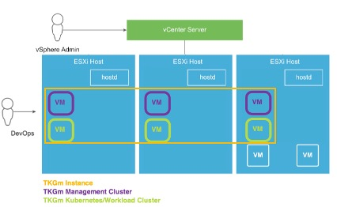
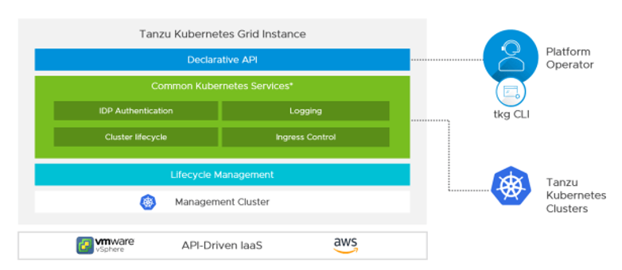
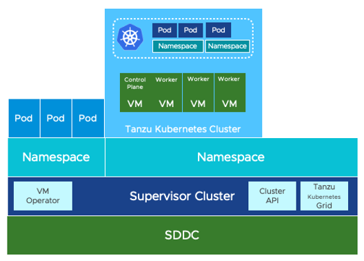
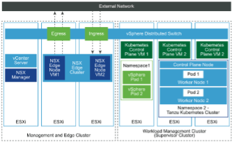

## Tanzu Kubernetes Grid 아키텍처

    Tanzu 환경의 활용법에 따라 VMware Tanzu Kubernetes Grid Multi-cloud와 
    VMware Tanzu Kubernetes Grid Service로 아키텍처가 상이할 수 있습니다.

### 개념 및 개요

#### Tanzu Kubernetes Grid 인스턴스

Tanzu Kubernetes Grid Instance는TKG 클러스터 및 서비스의 전체 배포를
의미합니다. 클러스터를 Azure에 배포 한 다음 AWS에 별도의 클러스터를 배포
한 경우 두 개의 개별 인스턴스가 됩니다.

#### 관리 클러스터(감독자 클러스터)

관리 클러스터는 Tanzu Kubernetes Grid 인스턴스를 생성할 때 가장 먼저
VM의 형태로 배포하는 요소입니다. 관리 클러스터는 TKG 의 기본 관리 및
운영 센터 역할을 수행하는 Kubernetes 클러스터입니다. 관리 클러스터는
Tanzu API를 실행하여 애플리케이션 워크로드(포드)가 실행되는 워크로드
클러스터(TKC)를 생성하고 각 워크로드 클러스터가 사용할 개별 또는 공유
서비스를 구성할 수 있습니다. 관리 클러스터를 배치하면 관리 클러스터에서
Antrea와의 네트워킹이 자동으로 활성화됩니다.

#### 워크로드 클러스터(TKC)

관리 클러스터를 배포 한 후 Tanzu CLI를 사용하여 VM의 형태로 워크로드
클러스터(TKC)를 배포합니다. 워크로드 클러스터(TKC)는 관리 클러스터를
통해 관리되는 애플리케이션 워크로드(포드) 가 실행되는 클러스터입니다.
워크로드 클러스터(TKC)는 실행되는 애플리케이션의 요구 사항에 따라 각기
다른 버전의 Kubernetes를 실행할 수 있습니다. Tanzu CLI를 사용하여
워크로드 클러스터(TKC)의 전체 수명 주기를 관리 할 수 ​​있습니다. 워크로드
클러스터(TKC)는 기본적으로 포드 간 네트워킹을 위해 Antrea를 구현합니다.

#### TKGm

비공식적으로 TKGm라고 알려진 VMware Tanzu Kubernetes Grid for
Multicloud는 vSphere의 온 프레미스와 Amazon EC2 및 Microsoft Azure의
퍼블릭 클라우드 모두에서 실행할 수있는 다중 클라우드 Kubernetes
제품입니다.

일반적인 일반적인 TKGm 배포는 **관리 클러스터 배포**에서 시작됩니다.
TKGm의 관리 클러스터는 Tanzu CLI Tool을 이용하여 두가지 방식으로 배포
가능합니다.

1.  CLI 및 구성 파일을 사용하여 배포

    -   <https://docs.vmware.com/en/VMware-Tanzu-Kubernetes-Grid/1.3/vmware-tanzu-kubernetes-grid-13/GUID-mgmt-clusters-deploy-cli.html>

2.  설치 프로그램 인터페이스를 실행하여 배포 (주로 해당 방법을 사용)

    -   <https://docs.vmware.com/en/VMware-Tanzu-Kubernetes-Grid/1.3/vmware-tanzu-kubernetes-grid-13/GUID-mgmt-clusters-deploy-ui.html>

2번 방법으로 배포하기 위해서는 AVI ALB, Tanzu CLI가 설치된 Bootstrap,
VMware K8s의 OVA를 이용한 템플릿이 필수로 필요합니다. 이후 관리
클러스터는 Bootstrap 을 사용하여 Tanzu-CLI를 통해 설치 프로그램
인터페이스를 실행시켜 배포됩니다. TKGs와 TKGm에서는 관리 클러스터는 VM을
기반으로 하며 TKGs와는 다르게 관리 클러스터는 vSphere와 통합되지
않습니다.

TKGm의 맥락에서 TKC는 관리 클러스터에 의해 배포됩니다. Tanzu CLI만을
사용하여 배포됩니다. 이러한 클러스터는 개발자가 애플리케이션을 실행하는
데 사용됩니다. 필요에 따라 필요한 Kubernetes 버전에서도 여러 클러스터를
배포 할 수 있습니다. 서로 다른 버전의 워크로드 클러스터 및 관리
클러스터를 가질 수 있습니다. 위의 이미지에서는 vSphere 환경과 Azure
모두에 대한 TKGm배포를 보여줍니다. (기본적으로 Calico는 네트워킹에
사용됩니다) TKGm은 Bootstrap을 통해서만 내부 Pods들의 상태 및
네임스페이스를 확인 할 수 있습니다.

1.  #### TKGs

    1.  #### vSphere with Tanzu의 개념

vSphere with Tanzu는 ESXi 호스트에서 기본적으로 Kubernetes 워크로드를
가상 머신과 나란히 실행하기 위한 플랫폼을 제공하는 기능입니다. vCenter
내에서 이 기능을 "워크로드 관리"라고합니다.

vSphere with Tanzu는 Tanzu Kubernetes Grid Service (TKGs)를 도입하여
Tanzu Kubernetes 클러스터를 vSphere를 통해 배포하고 실행할 수 있는
기능을 제공합니다. 즉, TKGs에서는 TKC를 Tanzu CLI와 더불어 vSphere Web
Client의 GUI에서도 관리할 수 있습니다.

vSphere 내의 기본 통합을 통해 TKGs는 기본 vSphere 스토리지 및 소프트웨어
정의 네트워킹 스택 인 NSX-T 와도 통합 할 수 있습니다. 즉, Pods 간의
네트워크를 NST-T로 가능하게 합니다.

vSphere with Tanzu를 사용하면 TKGm로 할 수있는 것처럼 **[TKG
클러스터]{.underline}**를 배포 할 수있을뿐만 아니라 고유하게 ESXi
호스트에서 **[Kubernetes 포드(vSphere Pod)]{.underline}**를 직접 실행할
수 있으며 vSphere 네임 스페이스라는 새로운 vSphere 개체를 도입합니다.

일반적인 TKGs 배포는 TKGs 인스턴스의 기본 관리 및 운영 센터 인
수퍼바이저 클러스터에서 시작됩니다. vSphere WebClient의 "워크로드 관리"
옵션을 통해 vSphere with Tanzu를 사용하도록 설정하면 수퍼바이저
클러스터라고도 불리는 관리 클러스터가 생성됩니다. 이 수퍼바이저
클러스터는 TKGm의 관리 클러스터와 비슷한 개념으로 vSphere 네임
스페이스를 포함하여 VMware 데이터 센터 내의 모든 Kubernetes 개체를
관리합니다. 워크로드 관리가 활성화되면 아래와 같은 그림처럼 Kubernetes
Control Plane이 배포되고 vSphere Pod 기능이 활성화되며 TKC가 수퍼바이저
클러스터를 통해 배포 될 수 있습니다. Kubernetes Control Plane은 TKC의
관리 클러스터 역할을 합니다. 따라서 TKGs는 Supervisor 클러스터에서
제공하는 관리 기능을 활용합니다.

#### vSphere with Tanzu의 구조

아래 다이어그램은 데이터 센터에서 실행되는 구성 요소의 논리적
다이어그램을 보여줍니다.

아래 이미지의 점선 내부에서 Kubernetes 리소스는 TKC를 구성하는 가상 머신
내부에서 실행됩니다.

#### vSphere 네임 스페이스

vSphere 네임 스페이스는 vSphere Kubernetes 수퍼바이저 클러스터에
생성되는 논리적 개체입니다. 이 개체는 리소스 할당 (컴퓨팅, 메모리,
스토리지 및 네트워크)을 편집하고 컨테이너 또는 가상 머신과 같은
Kubernetes 리소스에 대한 액세스 제어를 추적하고 제공합니다. 일부
문서에서는 이를 감독자 네임 스페이스로도 부릅니다.

vSphere 네임 스페이스는 Kubernetes 네임 스페이스입니다. 수퍼바이저
클러스터에 루트로 로그인하고 kubectl get namespace를 실행하면 vCenter
UI에 표시된 모든 네임 스페이스가 표시됩니다. 하지만 이러한 vSphere 네임
스페이스는 Supervisor 클러스터에서 생성 한 TKG 클러스터 내부에 생성되는
Kubernetes 네임 스페이스와 관련이 없습니다.

아래에서는 vCenter 인터페이스를 볼 수 있습니다. 여기에서 자세히 살펴볼
다양한 구성 요소와 방금 다룬 vSphere 네임 스페이스를 볼 수 있습니다.

#### 감독자 클러스터(수퍼바이저 클러스터)

수퍼바이저 클러스터은 ESXi를 워커 노드로 사용하는 특수한 Kubernetes
클러스터입니다. (vCenter UI보기에 대한 위의 이미지 설명을 참조하십시오.)
워크로드 관리가 활성화되면 제어 플레인 역할을하는 3개의 매니지먼트 노드
가상 머신 Supervisor Cluster가 배포됩니다.

수퍼바이저 클러스터는 Kubernetes 작업자 에이전트 인 Spherelets를 ESXi
하이퍼 바이저에 통합하여 만들어졌습니다. 이 클러스터는 vSphere Pod
Service를 사용하여 vSphere 호스트에서 기본적으로 컨테이너
워크로드(vSphere Pods)를 실행하고 ESXi 하이퍼바이저의 보안, 가용성 및
성능을 워크로드에 그대로 적용합니다.

#### Tanzu Kubernetes Cluster(TKC)

Tanzu Kubernetes Cluster (TKC)는 Tanzu Kubernetes Grid Service에서 배포
및 관리하는 Tanzu Kubernetes 배포에 사용되는 이름이며 vSphere 네임
스페이스 내부에 배포 된 가상 머신 개체를 이야기합니다.

이 Tanzu Kubernetes Grid 클러스터는 "워크로드 관리"에서 제공하는 TKGs에
의해 Tanzu CLI를 통해서 배포되므로 이러한 클러스터는 네트워킹을 위한
vSphere Storage 및 NSX-T (사용 가능한 경우)와 같은 기본 스택에도
통합됩니다. TKGs에 의해 프로비저닝된 TKC는 기존의 TKC와 완전히
동일하므로 예상할 수 있는 모든 유형의 쿠버네티스 워크로드를 구현할 수
있습니다.

TKC를 vSphere에서 배포하려면 TKC에 사용되는 VM 이미지를 가진 컨텐츠
라이브러리를 생성 해야합니다. 해당 이미지를 통해 TKG service API를
호출하는 선언적 YAML 파일을 사용하여 TKG 클러스터를 생성합니다.

단일 vSphere 클러스터 내에 여러 Tanzu Kubernetes 클러스터를 배포 할 수
있습니다.

#### TKGs 아키텍처의 장점

이 아키텍처에서는 워크로드 관리 클러스터뿐만 아니라 별도의 관리 및 Edge
클러스터를 사용할 수 있습니다. 관리/에지 클러스터와 워크로드 관리
클러스터를 결합한 Consolidated 아키텍처도 사용할 수 있습니다. 이
시나리오의 관리 및 Edge 클러스터는 TKG 관리 클러스터가 아니라
vSphere/NSX-T 관점에서 관리 클러스터입니다.

#### vSphere Pods 또는 Tanzu Kubernetes Cluster

<u>vSphere with Tanzu -- vSphere Pods 또는 Tanzu Kubernetes Cluster 중 애플리케이션을 실행하려면 어느 것을 선택해야할까?</u>
****test****
vSphere Pods :

-   가상 머신을 관리하는 것처럼 컨테이너를 관리 할 수있는 기능을
    제공합니다.

-   vSphere Pod 사용으로 더 강력한 보안 및 리소스 격리(isolation) 제공

-   **NSX-T 필요**

-   vSphere 포드의 성능 이점: Kubernetes가 포함 된 vSphere 7이 베어
    메탈보다 8 % 더 나은 성능을 제공합니다.

    -   <https://blogs.vmware.com/performance/2019/10/how-does-project-pacific-deliver-8-better-performance-than-bare-metal.html>

Tanzu Kubernetes Cluster :

-   업스트림 Kubernetes와 완전히 호환되는 Kubernetes 클러스터

-   업그레이드를 포함하여 vSphere와 독립적인 유연한 클러스터 수명주기
    관리

-   Antrea와 같은 오픈 소스 네트워킹 기술에 대한 광범위한 지원

      #### TKGs vs TKGm

-   TKGs는 vSphere 7 또는 VCF 4에서만 지원되는 옵션입니다.

-   vSphere with Tanzu가 활성화되지 않은 경우 TKGm을 vSphere 환경에 구축
    할 수 있습니다.

-   워크로드 관리가 활성화 된 vSphere 환경이 있는 경우. TKG 관리
    클러스터를 배포하는 대신 Tanzu Kubernetes Grid Service (TKGs)를
    활용하는 내장 수퍼바이저 클러스터를 사용하는 것이 좋습니다.

차이점| TKGM| TKGs
------------ | ------------- | -------------
관리 클러스터 이름     | 관리 클러스터                                     | 수퍼바이저 클러스터
관리 클러스터 생성 방식 | 로컬 머신에서 실행되는 부트 스트랩 클러스터를 사용하여 배포  | vSphere WebClient의 “워크로드 관리” 옵션을 통해 배포
워크로드 클러스터(TKC) 생성 방식 | Tanzu CLI를 사용하여 배포 | TKG service API를 호출하는 선언적 YAML 파일을 사용하여 배포
TKC 배포 방식 | VMware K8s의 OVA를 이용한 템플릿 | TKC에 사용되는 VM 이미지를 가진 컨텐츠 라이브러리를 생성

