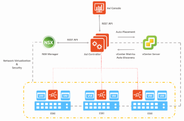
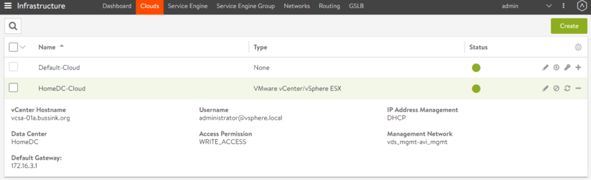
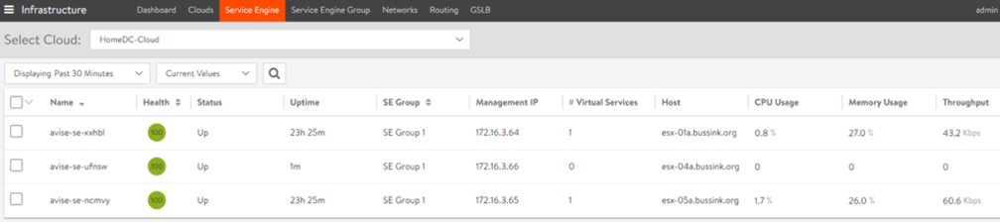
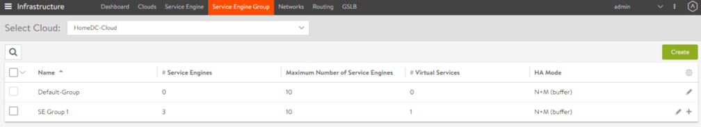
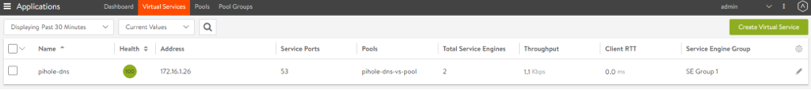

## 3. AVI ALB (로드밸런서)

### 개념 및 개요

Avi Networks 기술(이전의 Avi Vantage)을 기반으로 구축된 이 새로운 로드
밸런서는 vSphere with Tanzu 및 TKGm 배포 환경에 사용할 수 있는 또 다른
프러덕션-레디(production-ready) 로드 밸런서 옵션을 제공합니다. 이제 NSX
Advanced Load Balancer 또는 줄여서 NSX ALB라고 하는 이 로드 밸런서는
관리 클러스터 제어부 API 서버, TKC API 서버와 같이 로드 밸런서 서비스가
필요한 모든 Kubernetes 애플리케이션에 대해 가상 IP 주소(VIP)를
제공합니다.

### 동작 방법

NSX Advanced Load Balancer는 Tanzu Kubernetes Grid 에서 프로비저닝되는
TKC에 대해 동적으로 확장/축소하는 로드 밸런싱 end-point를 제공합니다.
Avi 컨트롤러 VM을 설치하고 구성하게 되면 새로이 생성되는 TKC 및 관리
클러스터 VM들에 대한 로드 밸런싱 end-point가 자동으로 프로비저닝됩니다.
예를 들어 새로운 TKC를 프로비저닝하면 컨트롤러는 가상 서비스를 생성하고
이 서비스를 호스팅할 서비스 엔진 VM을 배포합니다. 이 가상 서비스는
Kubernetes 제어부에 대한 로드 밸런싱을 제공합니다.

등록된 클러스터에 대해 로드 밸런서 유형의 Kubernetes 서비스를 생성하면
컨트롤러는 가상 서비스를 자동으로 생성하여 서비스 엔진에 배포합니다. 첫
번째 서비스 엔진은 첫 번째 가상 서비스가 구성된 후에만 생성됩니다.
후속으로 구성된 가상 서비스는 기존 서비스 엔진을 사용합니다. 하나의 VM에
여러 가상 서비스를 배포할 수 있습니다.

### AVI 아키텍처

크게 AVI는 다음과 같은 두개의 메인 파트로 나눌 수 있습니다. Management
Plane의 컨트롤러와 Data Plane의 서비스 엔진입니다. 컨트롤러는 구성과
정책을 위한 중앙 저장소로 서비스 엔진의 전체 라이프사이클(생성, 제어 및
삭제)을 관리합니다. 컨트롤러는 전용 가상 시스템에서 실행되며, vSphere
인프라에 통합된 컨트롤러를 사용하여 선택한 클러스터 전체에 서비스 엔진을
자동으로 배포 및 구성합니다. 컨트롤러는 권장 최소 요구사항인 24GB RAM,
노드당 8 vCPU 및 128GB Disk이며 이는 데이터 분석과 흐름 양에 따라
달라집니다.

컨트롤러가 구축되면 클라우드 인프라를 정의합니다. 여기에서 대상이 되는
vCenter를 입력합니다. 관리자 자격 증명을 사용하여 컨트롤러는 클러스터에
필요한 서비스 엔진을 프로비저닝할 수 있습니다.

서비스 엔진은 로드 밸런싱 알고리즘 또는 (HTTP/S) 헤더를 기반으로 연결을
분배하는 경량 데이터 평면 엔진입니다. 이러한 서비스 엔진은 백엔드 서버
앞단에서 로드 밸런싱을 수행하고 상태 모니터링 및 백엔드 서버의 성능
테스트와 같은 모든 데이터 평면 Application Delivery Controls 작업을
실행합니다.

그런 다음 서비스 엔진은 vSphere 호스트가 클러스터의 일부인 것처럼 서비스
엔진 그룹에 포함시킵니다.

로드 벨런싱을 위한 가상 서비스를 생성하면 이 서비스가 서비스 엔진 그룹
전체에 배포됩니다.

