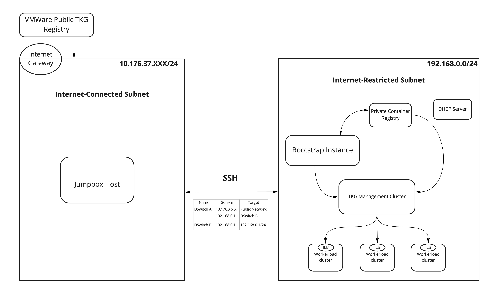

## 인터넷 차단 환경의 경우 사전 준비 사항
인터넷 차단 환경의 경우 TKG 설치 관련 이미지 및 CLI들을 사전에 다운로드 받은 Jumpbox 이미지를 준비해서 반입하는 것이 이후 작업에 용이합니다. 
본 섹션에서는 Jumpbox 이미지를 준비하는 절차에 대해 설명합니다.

### 작업 순서
1. Jumpbox VM 준비
2. Docker 설치
3. Harbor 설치 및 구성
4. CLI 설치
5. Harbor에 관련 이미지 복사
6. 네트워크 관련 사전 요구 사항

### 1. Jumpbox VM 준비
Ubuntu 기반의 OS가 설치된 VM 이미지를 준비합니다. 권고하는 리소스는 다음과 같습니다.
* vCPU: 4 이상
* Memory: 16 GB 이상
* Storage: 200 GB 이상

준비된 Jumpbox VM은 관련 소프트웨어 설치를 위하여 인터넷에 접속 가능하여야 합니다.

### 2. Docker 설치
다음 링크를 참고하여 준비된 Jumpbox 이미지에 Docker 및 Docker Compose를 설치합니다.
* [Docker 설치](https://docs.docker.com/engine/install/ubuntu/)
* [Docker Compose 설치](https://docs.docker.com/compose/install/)

### 3. Harbor 설치 및 구성
다음 링크를 참고하여 Harbor를 설치합니다. 지금 설치될 Harbor에는 TKG 설치를 위한 이미지가 저장되게 되고, 추후 업그레이드 등에 활용될 수 있으므로, 
설치 이후에도 계속 **유지하는 것을 권고**합니다. (단, 계속 구동시켜둘 필요는 없음)

Harbor 구성은 DNS 혹은 IP로 접속하도록 구성할 수 있으나, 별도의 DNS를 구축하는 것이 아니라면 IP로 구성하는 것이 이후 작업에 좀 더 수월합니다.

* [Harbor 다운로드](https://goharbor.io/docs/2.4.0/install-config/download-installer/)
* [HTTPS 접속을 위한 사설 인증서 구성](https://goharbor.io/docs/2.4.0/install-config/configure-https/) - Harbor IP 기반의 인증서 생성 
* [Harbor YAML 파일 구성](https://goharbor.io/docs/2.4.0/install-config/configure-yml-file/) - Harbor IP, 인증서 저장 위치 등을 구성
* [Harbor 구동](https://goharbor.io/docs/2.4.0/install-config/run-installer-script/) - Trivy, Notary 등의 컴포넌트를 함께 설치 가능

### 4. CLI 설치
필요한 CLI는 다음과 같습니다.
* [Tanzu CLI](https://customerconnect.vmware.com/en/downloads/info/slug/infrastructure_operations_management/vmware_tanzu_kubernetes_grid/1_x)
* kubectl - 위 링크에서 Tanzu CLI 버전과 호환 가능한 kubectl을 다운로드 가능
* [imgpkg](https://github.com/vmware-tanzu/carvel-imgpkg)
* [yq](https://github.com/mikefarah/yq#install): 버전 4.9.2 이상

### 5. Harbor에 관련 이미지 복사
다음 링크를 참고하여 TKG 설치를 위한 이미지들을 조금 전에 구성한 Harbor 레지스트리에 복사해 줍니다.
* [이미지 복사](https://docs.vmware.com/en/VMware-Tanzu-Kubernetes-Grid/1.5/vmware-tanzu-kubernetes-grid-15/GUID-mgmt-clusters-image-copy-airgapped.html)

복사가 잘 되었는지 이미지들을 docker cli나 Harbor web console에 접속하여 확인해 봅니다.

이제 인터넷 차단 환경을 위한 Jumpbox 준비가 완료되었습니다.

### 6. 네트워크 관련 사전 요구 사항
인터넷 차단 환경에서 설치를 위해 Jumpbox와 통신하여야 할 네트워크 구성입니다. 원활한 설치 작업을 위해서는 방화벽 신청을 완료하여야 합니다.
* vSphere
  > 

이상으로 인터넷 제한 환경에서의 설치를 위한 Jumpbox 설정이 완료되었습니다. 더 자세한 설명은 
[여기](https://docs.vmware.com/en/VMware-Tanzu-Kubernetes-Grid/1.5/vmware-tanzu-kubernetes-grid-15/GUID-mgmt-clusters-airgapped-environments.html)
를 확인하여 주시기 바랍니다.
