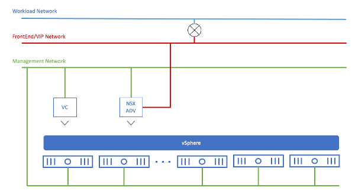

## 관리 클러스터 배포를 위한 사전 요구사항

### 관리 클러스터 배포 사전 구성요소

#### 사전 구성 요소 설명

Tanzu CLI 또는 설치 관리자 인터페이스를 사용하여 관리 클러스터를
배포하려면 먼저 vSphere 환경을 준비해야 합니다. vSphere가 일반적인 요구
사항을 충족하는지 확인하고 Tanzu Kubernetes Grid가 클러스터 노드 VM을
생성하는 기본 이미지 템플릿을 가져와야 합니다. 각 기본 이미지 템플릿에는
시스템 OS 버전과 Kubernetes 버전이 포함되어 있습니다.

(1) vSphere 환경

    A.  TKG 를 지원하는 버전 및 에디션의 vSphere 환경으로는 vSphere 7,
        vSphere 6.7u3 (Enterprise Plus)이 있습니다. 본 매뉴얼에서는
        vSphere 7환경으로 구성을 하였습니다. vSphere 환경은 ESXi가
        설치된 호스트에 대해 vCenter Server를 통한 관리가 가능하도록
        네트워크 등의 구성이 완료된 환경을 의미합니다.

    B.  모든 호스트 및 VCSA의 NTP 동기화

    C.  Sphere 환경 구성에 대한 설명은 보유 인프라에 따라 상이하므로 본
        매뉴얼에서는 설명을 생략합니다.

(2) 네트워크 : 3개 혹은 2개의 네트워크 대역폭이 필요합니다. 각각 관리
    네트워크, 워크로드 네트워크, VIP 네트워크 입니다.

    A.  3개의 네트위크 대역폭으로 구성

> 
>
> 위 다이어그램에서 NSX ALB는 별도의 Frontend/VIP 및 Workload 네트워크가
> 있는 배포 환경에 있습니다. 이러한 유형의 배포가 구현되면 VIP
> 네트워크와 워크로드 네트워크 간에 경로가 있어야 합니다.

    B.  2개의 네트워크 대역폭으로 구성

> 
>
> 위 다이어그램은 동일한 네트워크의 IP 주소 범위를 사용하여 VIP 주소와
> 워크로드 IP 주소 요구 사항을 충족하는 다른 배포 방법입니다.
>
> 두 선택지 중 하나를 선택했다면 시작하기 전에 고려해야 할 요구사항은
> 다음과 같습니다.

-   앞에서 언급한 관리 네트워크의 AVI ALB에 대한 1개의 정적 IP 주소

-   관리 네트워크에서 서비스 엔진의 정적 IP 주소 X개의 범위

-   관리 네트워크의 관리 클러스터 콘트롤 플레인 노드에 대한 5개의 정적
    IP 주소 범위

-   VIP 네트워크의 Y개 로드 밸런서 VIP 수 범위

-   워크로드 네트워크에 DHCP 구성

-   워크로드 네트워크의 관리 클러스터 콘트롤 플레인과 TKC 노드의 Z개의
    IP 주소 범위

    -   위의 X, Y 및 Z 범위는 관리자에 의해 결정되며 배포되는 게스트
        클러스터 및 로드 밸런서 서비스 애플리케이션의 크기와 수에 따라
        달라질 가능성이 높습니다.

참조 :
<https://docs.vmware.com/en/VMware-Tanzu-Kubernetes-Grid/1.3/vmware-tanzu-kubernetes-grid-13/GUID-mgmt-clusters-vsphere.html>
