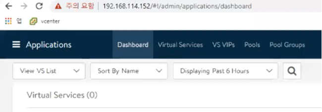
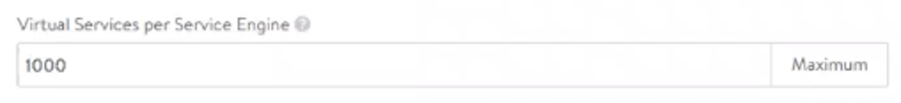

## AVI ALB (로드밸런서)

### AVI 컨트롤러 설치

(1) 다음 URL에 들어가 상단의 **DOWNLOAD** 버튼을 클릭합니다.

    A.  URL: <https://tanzu.vmware.com/kubernetes-grid>

> 

(2) 열린 창에서 "VMware NSX Advanced Load Balancer"의 **GO TO DOWNLOAD** 버튼을 클릭합니다.

> 

(3) 다음 열리는 AVI Portal에서 상단의 **Software** 메뉴를 클릭합니다.

> 

(4) 화면 스크롤을 내려서 20.1.3 버전을 클릭합니다.

> 

(5) 새로 열린 창에서 VMware종류 창에 Controller OVA오른쪽 부분의 화살표 모양의 다운로드 버튼을 눌러 AVI ALB OVF파일을 받습니다.

> 

(6) 지정한 로컬 폴더에 다운로드가 완료 되었는지 확인합니다.

> 

(7) vSphere Web Client에서 AVI ALB를 설치할 클러스터에 오른쪽 클릭을
    하여 "OVF 템플릿 배포" 버튼을 클릭합니다.

> 

(8) OVF 템플릿 선택 화면에서 **로컬 파일**을 선택하고 **파일 업로드
    버튼**을 클릭하여 다운로드 받은 AVI ALB OVF파일을 선택하고 **열기**
    버튼을 클릭하여 불러옵니다.

> 

(9) 파일이 아래와 같이 제대로 불러져 왔는지 확인한 이후 **다음** 버튼을 눌러 다음 페이지로 넘어갑니다.

> 

(10) 가상 시스템 이름란에**avi-controller-1**을 입력하고 **다음** 버튼을 눌러 다음 페이지로 넘어갑니다.

(11) 계산 리소스 선택 화면에서는 AVI ALB를 배포할 클러스터를 선택하고 **다음** 버튼을 누르세요.

(12) 세부 정보 검토 화면에서 **다음** 버튼을 누르세요.

(13) 스토리지 선택 화면에서는 VM 스토리지 정책에서 **Management Storage
     Policy - Thin** 옵션을 선택하고 AVI ALB를 설치할 데이터스토어를
     선택한 후 **다음** 버튼을 누르세요.

(14) 네트워크 선택 화면에서는 대상 네트워크 옵션을 미리 지정해 놓은 관리
     네트워크의 포트그룹으로 선택하고 **다음** 버튼을 누르세요.

> 

(15) 템플릿 사용자 지정 화면에서는 Management Interface IP Address에는
     AVI ALB VM에 할당될 관리 네트워크 IP 1개를 입력하여 지정해주고 이후
     각각 Subnet과 Gateway에는 관리 네트워크 대역폭의 서브넷 마스크와
     게이트웨이를 차례로 입력합니다. 이후 **다음** 버튼을 클릭하여 다음
     페이지로 넘어갑니다.

> 

(16) 완료 준비 페이지에서 여태 입력된 값들이 문제없이 들어갔는지
     확인하고 **완료** 버튼을 눌러 설치를 완료합니다. 이후 OVF가
     정상적으로 배포 되었는지 vSphere Web Client 인벤토리를 통해
     확인합니다.

### AVI 로드밸런서 배포

(1) 설치가 완료된 AVI ALB VM의 IP를 웹브라우저에 입력하여 AVI 로드밸런서
    배포 환경에 접속합니다.

> 

(2) 다음과 같은 AVI 설정 화면이 나온다면 AVI자체적으로 쓰일 Username과
    Password를 입력하고 Create Account를 클릭합니다.

> 

(3) 다음 화면에서는 vSphere 환경의 DNS주소와 Domain을 입력하고 Backup
    Passphrase를 임의로 입력합니다. 이후 스크롤을 내려서 NTP Server 칸에
    NTP 주소를 입력하고 Next 버튼을 누릅니다.

>  

(4) Email/SMTP 에서 None을 선택하고 Next를 누릅니다.

> 

(5) 이후 Orchestrator Integration 화면에서는 아래와 같이 VMware 환경을
    클릭하여 선택합니다.

> 

(6) 이후 현재 구성되어 있는 vCenter에 대한 로그인 정보와 IP/ DNS 주소를
    아래와 같이 입력하고 Next 버튼을 클릭합니다.

> 

(7) AVI가 소속될 데이터센터를 선택하고 Next 버튼을 클릭합니다.

> 

(8) 관리 네트워크의 포트 그룹을 입력하고 관리 네트워크의 대역폭과 사전에
    지정한 관리 네트워크 고정 IP 풀과 게이트웨이를 차례대로 입력하고
    Next를 누릅니다.

> 

(9) 다음 나오는 Tenant Setting에서는 No 버튼을 클릭합니다.

(10) 이후 설정이 완료되면서 아래와 같이 AVI ALB의 Dashboard화면으로
     자동으로 리다이렉팅 되게 됩니다.

> 

(11) 이후 아래와 같이 좌측 상단에 Administration 메뉴창에 들어갑니다.

> 

(12) 이후 Setting 상단 메뉴에 Access Settings 하위 메뉴를 선택한 이후
     오른쪽에 펜
     모양()의 편집 버튼을 클릭합니다.

> 

(13) 새로 팝업된 화면에서 SSL/TLS Certificate 칸의 기존의 인증서들을 x
     버튼을 눌러 모두 삭제한 이후 아래와 같이 화살표 모양 버튼을 눌러서
     Create Certificate버튼을 클릭합니다.

> 

(14) Add Certificate화면에서 Name에는 controller-vip-cert를 입력하고
     Common Name에는 controller.areslav.lab과 같이 DNS에 등록되는 AVI
     ALB VM의 도메인 주소를 입력합니다.

> 

(15) 이후 스크롤을 내려서 Subject Alternate Name(SAN)항목에 Add
     Item버튼을 이용하여 두개의 입력 칸을 만든 후 각각 DNS 도메인 주소와
     AVI ALB VM에 할당될 관리 네트워크의 두번째 고정 IP를 입력합니다.
     이후 Save 버튼을 눌러줍니다.

> 

(16) 아래와 같이 SSL/TLS Certificate란에 새로 추가된 인증서가 제대로
     추가되었는지 확인하고 Save 버튼을 누릅니다.

> 

(17) 이후 상단에 Controller 메뉴에 들어가 녹색의 Edit
     버튼()을 클릭합니다.

(18) 새로 나타난 팝업창에서 Controller Cluster IP에 인증서 생성에서
     입력한 AVI ALB VM에 할당될 관리 네트워크의 두번째 고정 IP를
     입력하고 Cluster Nodes에 고정 IP 옆에 Password에 AVI ALB 에서
     설정한 비밀번호를 입력합니다. 이후 Save 버튼을 누릅니다.

> 

(19) 이후 웹브라우저에 AVI ALB VM에 할당될 관리 네트워크의 두번째 고정
     IP를 입력하여 접속합니다.

> 

(20) 접속한 화면에서 Avi에 로그인합니다.

> 

(21) 이후 아래와 같이 상단 메뉴 버튼을 클릭하여 Templates 메뉴를
     클릭합니다.

> 

(22) 이후 상단 메뉴에서 Profiles 상위 메뉴에 들어가서 IPAM/DNS Profiles
     하위 메뉴를 클릭합니다. 이후 파란색
     CREATE버튼()을 클릭하고 IPAM Profile 버튼을
     클릭합니다.

> 

(23) 새로 팝업된 창에서 Name에 ipam-profile-vip라고 입력하시고 Cloud for
     Usable Network는 Default-Cloud로 Usable Network에는 사전에 정의된
     VIP 네트워크의 포트그룹을 선택하여 입력합니다. 이후 Save 버튼을
     클릭합니다.

> 

(24) 이후 파란색
     CREATE버튼()을 클릭하고 DNS Profile 버튼을
     클릭합니다.

(25) 새로 팝업된 창에서 Add DNS Service Domain 버튼을 클릭하고 Domain
     Name에는 areslav.lab과 같은 사전 정의된 DNS 도메인을 입력합니다.
     이후 Name에 dns-profile라고 입력한 후 Save 버튼을 클릭합니다.

> 

(26) 이후 아래와 같이 상위 메뉴 버튼을 클릭하여 Infrastructure메뉴를
     클릭합니다.

> 

(27) 아래와 같이 상단에 Networks 메뉴를 클릭하여 들어갑니다.

> 

(28) 아래와 같이VIP 네트워크를 구성하는 포트 그룹의 편집
     버튼()을 클릭합니다.

> 

(29) 새로운 팝업창에서 IP Subnet 표 오른편에 편집
     버튼()을 클릭합니다.

(30) 이후 Add Static IP Address Pool 버튼을 누르고 Use Static IP Address
     for VIPs and SE를 클릭하여 체크합니다. 이후 아래와 같이 사전에
     정의된 VIP 네트워크의 범위를 새로운 칸에 입력하고 Save버튼을
     누릅니다.

> 

(31) 이후 아래와 같이 상단에 Clouds 메뉴를 클릭하여 들어갑니다.

> 

(32) Default-Cloud 개체 오른편에 편집
     버튼()을 클릭합니다.

(33) 아래와 같이IPAM/DNS 설정에서 이전 과정으로 통해 새로이 정의한
     ipam-profile-vip와 dns-profile을 각각의 칸에서 선택하고 Save버튼을
     클릭합니다.

> 

(34) 이후 아래와 같이 상위 메뉴 버튼을 클릭하여 Infrastructure메뉴를
     클릭합니다.

> 

(35) 상단에 Service Engine Group 메뉴를 클릭하여 들어갑니다. 이후
     Default-Group 개체 오른편에 편집
     버튼()

(36) 새로운 팝업창에서 High Availiability Mode를 아래의 그림과 같이
     Active/Stanby를 클릭하여 체크합니다.

> 

(37) 이후 아래의 그림처럼 Virtual Services per Service Engine을 기존의
     10에서 1000으로 수정합니다.

> 

(38) 새로운 팝업창 상단에 아래 그림처럼 Advanced 메뉴를 클릭합니다.

> 

(39) 이후 아래와 같이Host & Data Store Scope 속성에 Cluster 개체를 TKG가
     실행될 클러스터로 선택하고 Save 버튼을 클릭합니다.

> 

(40) 이후 아래와 같이 상위 메뉴 버튼을 클릭하여 Infrastructure메뉴를
     클릭합니다.

> 

(41) 상단에 Routing 메뉴를 클릭하여 들어갑니다.

(42) Static Route 속성에서 파란색
     CREATE버튼()을 클릭합니다.

(43) 새로운 팝업창에서 Gateway Subnet은 워크로드 네트워크의 서브넷을
     입력하고 Next Hop에는 VIP 네트워크의 Gateway 주소를 입력합니다.
     이후 Save 버튼을 누릅니다.

> 

(44) 이후 아래와 같이 좌측 상단에 Administration 메뉴창에 들어갑니다.

> 

(45) (옵션) 이후 상단 메뉴에 Settings에 들어가서 Licensing 하위 메뉴를
     클릭하여 Licensing 문자 옆에 있는 편집 톱니바퀴
     버튼()을 클릭하여 라이센스를 설정합니다.

>  

(46) 이렇게 설정이 끝났다면 AVI ALB의 설정은 완료되었습니다.

