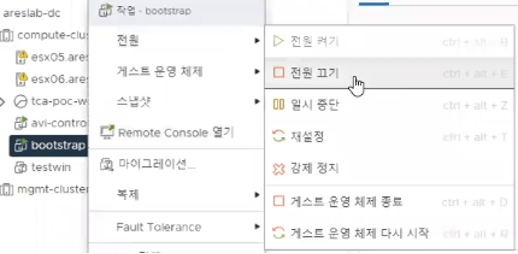
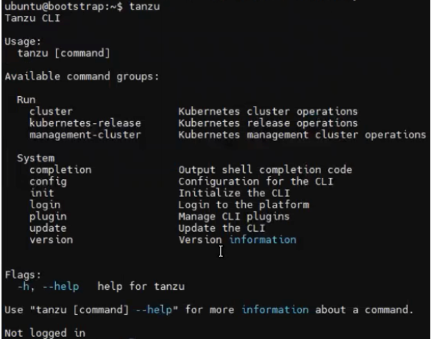

## Bootstrap Machine설치

### 용도 및 설치 방법

#### Bootstrap 의 용도 및 필요성

TKG 환경은 Tanzu CLI를 통해 관리할 수 있기 때문에TKG를 운영하기 위해서는
Tanzu Kubernetes Grid 명령줄 인터페이스(Tanzu CLI)를 다운로드하여
부트스트랩 환경에 설치해야 합니다. VMware는 Linux, MacOS 및 Windows
시스템을 위한 CLI 바이너리를 제공합니다. 즉, Bootstrap machine
(부트스트랩 머신)은Tanzu CLI를 통해 TKG 환경을 관리할 콘솔로 작동하는
구성 요소 입니다. 해당 머신에 Tanzu CLI, Docker 및 kubectl 설치되어
있어야 합니다.

#### 설치 과정

(1) Bootstrap VM 생성을 위해 먼저 vCenter에 우분투 이미지의 VM 템플릿을
    준비합니다.

(2) 이후 해당 VM 템플릿을 오른쪽 클릭하여 "이 팀플릿에서 새 VM 생성"
    버튼을 클릭합니다.

> 

(3) VM 이름으로 bootstrap을 입력하고 다음을 클릭합니다.

(4) Bootstrap을 배포할 클러스터를 선택하고 다음 버튼을 클릭합니다.

(5) 스토리지 선택 화면에서는 VM 스토리지 정책에서**Management Storage
    Policy - Thin** 옵션을 선택하고 Bootstrap을 설치할 데이터스토어를
    선택한 후 **다음** 버튼을 누르세요.

(6) 다음 페이지에서 **다음** 버튼을 누르세요.

(7) Bootstrap VM은 kind cluster가 구동되고, 관련된 container image 및
    설치 파일을 업로드 하여 작업이 일어나게 됩니다. 문서 가이드에 따라
    최소 2 core CPU, 6 GB Memory 이상 및 디스크를 설정합니다. Thin으로
    디스크를 설정했기 때문에, 실제 사용 디스크만 사용하게 됩니다.\
    <https://docs.vmware.com/en/VMware-Tanzu-Kubernetes-Grid/1.3/vmware-tanzu-kubernetes-grid-13/GUID-install-cli.html#prerequisites-0>\
    

(8) 입력한 정보가 맞는지 확인하고 **완료** 버튼을 누르세요.

(9) 생성된 bootstrap VM의 전원을 키고 접속하여 Terminal 창을 엽니다.

(10) 아래와 같은 명령어를 입력합니다.

> 

(11) Address, network, broadcast, gateway를 미리 지정한 VIP 네트워크에
     맞춰서 아래와 같이 수정합니다.

> 

(12) 수정 이후 **:wq!** 명령어를 통해 저장합니다.

(13) 이후 vSphere Web Client에서 다음과 같은 버튼을 클릭하여bootstrap
     VM의 전원을 끕니다.

> 

(14) 전원이 꺼졌다면 전원 켜기 버튼을 눌러 VM의 전원을 다시 킵니다.

> 

(15) 이후 웹브라우저를 통해 tanzu.vmware.com에 접속합니다. Product
     메뉴에 들어가 View all products에 들어갑니다.

> 

(16) 이후 밑으로 스크롤을 하여Tanzu Kubernetes Grid 를 클릭하여 들어가서
     Download메뉴를 클릭합니다.

(17) 새로 열린 창에서 VMware Customer Connect 사이트에 로그인합니다.

(18) 이후

     A.  VMware Tanzu CLI for Linux,

     B.  kubectl cluster cli v1.20.5 for Linux

     C.  VMware Tanzu Kubernetes Grid Extensions Manifest 1.3.1

     D.  Velero v1.5.4 for Linux for Tanzu Kubernetes Grid 1.3.1

> 를 모두 클릭하여 다운로드 받습니다.
>
> 

(19) 해당 압축파일들을 모두 bootstrap VM 의 ../../media 폴더를 만들어
     옮깁니다.

> 

(20) 아래 Docker Engine 설치 공식 사이트에 들어가 절차대로 bootstrap
     ubuntu에 Docker Engine을 설치합니다. 설치가 정상적으로 완료되었다면
     아래와 같은 화면과 유사한 화면을 볼 수 있습니다.

> URL: <https://docs.docker.com/engine/install/ubuntu/>
>
> 예상 실행 코드:
>
> 
>
> \*\*주의) Docker Engine의 버전에 따라 설치에 실행되는 코드는 상이할 수
> 있습니다.
>
> 설치 완료 화면:
>
> 

(21) 아래 Tanzu CLI 설치 공식 사이트에 들어가 절차대로 bootstrap
     ubuntu에 Tanzu CLI를 설치합니다.

> URL:
> <https://docs.vmware.com/en/VMware-Tanzu-Kubernetes-Grid/1.3/vmware-tanzu-kubernetes-grid-13/GUID-install-cli.html#install-cli>
>
> 예상 실행 코드:

\# ZIP 파일 압축 해제

gzip -d \*.gz

mkdir tanzu

tar xvf tanzu-cli-bundle-\*linux-amd64.tar -C tanzu

tar xvf tkg-extensions-manifests-v1.3.\*.tar

\# tanzu cli

sudo cp tanzu/cli/core/v\*/tanzu-core-linux_amd64 /usr/local/bin/tanzu

sudo chmod +x /usr/local/bin/tanzu

tanzu plugin clean

tanzu plugin install \--local tanzu/cli all

tanzu plugin list

echo \'source \<(tanzu completion bash)\' \>\>\~/.bashrc

sudo sh -c \'tanzu completion bash \>/etc/bash_completion.d/tanzuctl\'

\# kubectl

chmod +x ./kubectl-linux-v1.20.\*

sudo cp ./kubectl-linux-v1.20.\* /usr/local/bin/kubectl

\# others

gzip -d -f tanzu/cli/\*.gz

sudo cp tanzu/cli/imgpkg-linux-amd64-\* /usr/local/bin/imgpkg

sudo cp tanzu/cli/kapp-linux-amd64-\* /usr/local/bin/kapp

sudo cp tanzu/cli/kbld-linux-amd64-\* /usr/local/bin/kbld

sudo cp tanzu/cli/ytt-linux-amd64-\* /usr/local/bin/ytt

sudo chmod +x /usr/local/bin/\*

\# Enable kubectl autocompletion

echo \'source \<(kubectl completion bash)\' \>\>\~/.bashrc

sudo sh -c \'kubectl completion bash \>/etc/bash_completion.d/kubectl\'

echo \'alias k=kubectl\' \>\>\~/.bashrc

echo \'complete -F \_\_start_kubectl k\' \>\>\~/.bashrc

> \*\*주의) Tanzu CLI의 버전에 따라 설치에 실행되는 코드는 상이할 수
> 있습니다.

(22) 아래와 같이 tanzu 를 명령어로 입력하여 Tanzu CLI가 제대로 설치
     되었는지 확인합니다.

> 
