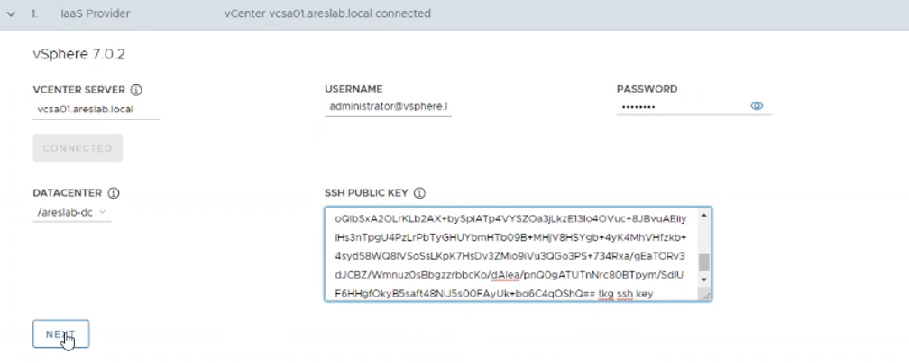

## 관리 클러스터 배포

### 설치 방법

(1) 관리 클러스터 VM 생성을 위한 OVA 파일을 다운도르 하기 위하여
    tanzu.vmware.com에 접속합니다. 이후Product 메뉴에 들어가 View all
    products에 들어갑니다.

> 

(2) 이후 밑으로 스크롤을 하여Tanzu Kubernetes Grid 를 클릭하여 들어가서
    Download메뉴를 클릭합니다.

(3) 새로 열린 창에서 VMware Customer Connect 사이트에 로그인합니다.

(4) 이후 Photon v3 Kubernetes v1.20.5 OVA를 클릭하여 다운로드 받습니다.

(5) vSphere Web Client에서 관리 클러스터 VM을 설치할 클러스터에 오른쪽
    클릭을 하여 "OVF 템플릿 배포" 버튼을 클릭합니다.

> 

(6) OVF 템플릿 선택 화면에서 **로컬 파일**을 선택하고 **파일 업로드
    버튼**을 클릭하여 다운로드 받은 Photon v3 Photon v3 Kubernetes
    v1.20.5 OVA파일을 선택하고 **열기** 버튼을 클릭하여 불러옵니다.

> 

(7) 파일이 아래와 같이 제대로 불러져 왔는지 확인한 이후 **다음** 버튼을
    눌러 다음 페이지로 넘어갑니다.

> 

(8) 가상 시스템 이름 란을 바꾸지 말고 템플릿을 저장할 폴더를 선택하고
    **다음** 버튼을 눌러 다음 페이지로 넘어갑니다.

(9) 계산 리소스 선택 화면에서는 관리 클러스터 VM을 배포할 클러스터를
    선택하고 **다음** 버튼을 누르세요.

(10) 세부 정보 검토 화면에서 **다음** 버튼을 누르세요.

(11) 라이센스 계약 화면에서 "모든 라이센스 계약에 동의합니다" 체크박스를
     클릭하고 다음 버튼을 누르세요.

(12) 스토리지 선택 화면에서는 VM 스토리지 정책에서 **Management Storage
     Policy - Thin** 옵션을 선택하고 관리 클러스터 VM을 설치할
     데이터스토어를 선택한 후 **다음** 버튼을 누르세요.

(13) 네트워크 선택 화면에서는 대상 네트워크 옵션을 미리 지정해 놓은
     워크로드 네트워크의 포트그룹으로 선택하고 **다음** 버튼을 누르세요.

> 

(14) 완료 준비 페이지에서 여태 입력된 값들이 문제없이 들어갔는지
     확인하고 **완료** 버튼을 눌러 설치를 완료합니다. 이후 OVA가
     정상적으로 배포 되었는지 vSphere Web Client 인벤토리를 통해
     확인합니다.

(15) 배포된 photon-3-kube-v1.20.5+vmware.1 VM을 아래와 같이 오른쪽
     클릭하여 템플렛으로 저장 버튼을 클릭하고 팝업창에 "예" 버튼을
     클릭하여 템플릿화 시켜줍니다.

> 

(16) Bootstrap 의 terminal에 접속합니다.

(17) 2021년 5월 리눅스 보안 패치로 인한 Management Cluster 생성시 kind
     cluster 오류 발생합니다.\
     <https://docs.vmware.com/en/VMware-Tanzu-Kubernetes-Grid/1.3.1/rn/VMware-Tanzu-Kubernetes-Grid-131-Release-Notes.html>\
     \
     

(18) 위 오류를 사전에 막기 위해 Management Cluster를 생성하기 전에 다음
     명령을 먼저 실행합니다.

> cat /proc/sys/net/netfilter/nf_conntrack_max
>
> sudo sysctl net/netfilter/nf_conntrack_max=131072

(19) OS Image 업데이트로 인한 OS Image 등록
     변경(https://docs.vmware.com/en/VMware-Tanzu-Kubernetes-Grid/1.3/vmware-tanzu-kubernetes-grid-13/GUID-mgmt-clusters-deploy-ui.html)

> rm -rf \~/.tanzu/tkg/bom
>
> export TKG_BOM_CUSTOM_IMAGE_TAG=\"v1.3.1-patch1\"
>
> tanzu management-cluster create

(20) 아래와 같은 명령어를 실행합니다. 여기서 192.168.115.11 대신
     bootstrap VM의 고정 IP를 입력하시면 됩니다.

> tanzu management-cluster create \--ui \--browser none
> \--bind=192.168.115.11:8080

     이후 아래와 같은 결과가 나오면 결과로 나온 http 주소를 복사하여
     웹브라우저를 통해 접속합니다.

> 

(21) 아래와 같은 화면이 뜨면 VMware vSphere에 해당되는 Deploy 버튼을
     누릅니다.

> 

(22) 다음 화면에서는 VCENTER SERVER 의 주소와 사용자 이름 및 비밀번호를
     순차적으로 입력합니다. 이후 Connect 버튼을 클릭합니다.

> 

(23) Verify SSL Thumbprint에서 CONTINUE 버튼을 클릭하여 넘어갑니다.

(24) (옵션) vSphere가 7.0버전 이상이라면 해당 화면이 뜰텐데요. 해당
     화면은 7.0에서 vSphere with Tanzu가 아닌 TKGm을 사용하는게
     확실한지를 결정하는 창입니다. 해당 창에서 DEPLOY TKG MANAGEMENT
     CLUSTER를 클릭합니다.

> 

(25) 이후 DATACENTER란에서 TKGm관리 클러스터를 설치할 데이터센터를
     선택합니다. SSH PUBLIC KEY에 값을 입력하기 위해 bootstrap VM으로
     돌아갑니다.

(26) VM의 Terminal에서 다음과 같은 명령어를 사용하여 SSH Key를
     생성합니다.

> ssh-keygen -t rsa -b 4096 -C <email@example.com>
>
> ssh-add \~/.ssh/id_rsa
>
> cd .ssh/
>
> ls
>
> cat id_rsa.pub

(27) 마지막 cat 명령어로 보이는 public key의 값을 복사하여 관리 클러스터
     배포 화면의 SSH PUBLIC KEY에 붙여 넣습니다. 이후 아래와 같이 NEXT
     버튼을 클릭합니다. 이후 생성된 Node VM에 private key로 ssh 접속이
     가능합니다.

> 

(28) 이후 나타나는 화면에 Development와 Production의 차이는 Master
     Node를 1개를 할 것인지 3개를 할 것인지에 대한 차이이다. 현재는
     PoC환경이기에 Development의 INSTANCE TYPE를 클릭하여 생성한 노드의
     크기를 선택합니다. 이후 MANAGEMENT CLUSTER NAME에는 TKGmgmt를
     입력하고 WORKER NODE INSTANCE TYPE을 통해 워커노드의 크기를
     선택합니다. CONTROL PLANE ENDPOINT에는 워크로드 네트워크의 DHCP
     범위와 겹치지 않는 같은 워크로드 네트워크 서브넷의 고정 IP하나를
     입력하고 NEXT 버튼을 클릭하여 넘어갑니다.

> 

(29) 이후 AVI ALB 정보를 CONTROLLER HOST에는 Controller Cluster IP를
     입력하고 USERNAME과 PASSWORD에는 AVI ALB 설치 시 설정했던 값들을
     입력합니다.

> 

(30) 이후 CONTROLLER CERTIFICATE AUTHORITY란에 들어갈 인증서를 받아오기
     위해 AVI ALB에 로그인하여 아래와 같이 좌측 상단에 Templates
     메뉴창에 들어갑니다.

> 

(31) 이후 Security 상단 메뉴에 SSL/TLS Certificates하위 메뉴를 선택한
     이후 controller-vip-cert 개체 오른쪽에 화살표 다운로드
     모양()의 다운로드 버튼을 클릭합니다.

> 

(32) 새로 팝업된 화면에서 Certificate란 아래의 Copy to Clipboard 버튼을
     클릭하여 인증서를 복사하여 관리 클러스터 배포 화면의 CONTROLLER
     CERTIFICATE AUTHORITY에 붙여 넣습니다. 이후 아래와 같이 VERIFY
     CREDENTIALS 버튼을 클릭합니다.

> 

(33) 이후 접속이 완료되면 아래와 같이CLOUD NAME에는 Default-Cloud를
     선택하고 SERVICE ENGINE GROUP NAME에는 Default-Group을 선택하며 VIP
     NETWORK NAME에는 VIP 네트워크의 포트그룹을 선택해줍니다. 이후
     CIDR는 VIP 네트워크의 대역폭에 맞는 선택지를 클릭하고 NEXT 버튼을
     누릅니다.

> 
>
> \*\*여기서 Cluster Labels란 AVI를 이용하여 배포할 클러스터의 레이블을
> 지정하는건데 입력하지 않으면 이후 생성되는 모든 클러스터는 AVI를
> 통한다는 것입니다.

(34) 이후 Metadata의 경우 아무것도 입력하지 말고 NEXT 버튼을 클릭합니다.

(35) vSphere Web Client로 접속하여 TKG를 위한 Resource풀을 만들기 위해
     클러스터 객체에 오른쪽 클릭을하고 "새 리소스 풀" 버튼을 클릭합니다.

> 

(36) 이후 이름에 TKGm이라고 입력한 후 확인 버튼을 눌러 생성합니다.

> 

(37) 그리고 다시 관리 클러스터 배포 화면으로 돌아가서 아래의 화살표
     모양의 새로고침 버튼을 클릭합니다.

> 

(38) 이후 VM FOLDER에는 TKGm 관리 클러스터 노드들이 위치할 폴더를
     설정하고 DATASTORE에는 해당 노드 VM들이 저장될 데이터스토어를
     선택하며 바로 전 단계에 생성한 리소풀을 선택합니다. 이후 이래의
     그림 처럼 NEXT버튼을 클릭합니다.

> 

(39) 아래와 같이NETWORK NAME에는 DHCP가 설정된 워크로드 네트워크
     포트그룹을 선택하고 나머지는 수정하지 않고 NEXT버튼을 눌러 다음으로
     넘어갑니다.

> 

(40) 다음 화면에서 Enable Identity Management Settings를 클릭하여
     Disable해주고 NEXT 버튼을 눌러 다음으로 넘어갑니다.

> 

(41) OS Image는 이전 단계에서 템플릿화 시켰던
     photon-3-kube-v1.20.5+vmware.1 을 선택하고 NEXT 버튼을 눌러줍니다.

> 

(42) 이 다음 화면은 TMC를 등록하는 절차이지만 해당 메뉴얼은 TKG를 위한
     것이기에 아무것도 입력하지 않고 NEXT를 눌려줍니다.

> 

(43) 이후 마지막 단계에서 아래와 같이 체크박스를 해제하고 NEXT를 누르고
     REVIEW CONFIGURATION 버튼을 클릭합니다.

> 

(44) 이후 입력한 모든 정보가 맞는지 확인하고 파란색
     버튼을 클릭합니다.

(45) 새로운 화면에서는 설치되고 있는 과정을 보여주는 화면이 나오게
     됩니다.

(46) 다음과 같은 화면이 나오고 vSphere Web Client 상에 두번째 그림과
     같이 새로운 VM들이 정상적으로 동작하고 있다면 관리 클러스터 배포가
     끝나게 됩니다.

> 
  

(47) 현재 관리 클러스터에 대한 상태를 확인하기 위해서는 Bootstrap에
     들어가서 tanzu cluster list --include-management-cluster 라고
     명령어를 치게 되면 아래와 같은 그림으로 정상적으로 돌아가는 관리
     클러스터를 볼 수 있습니다.

> 
