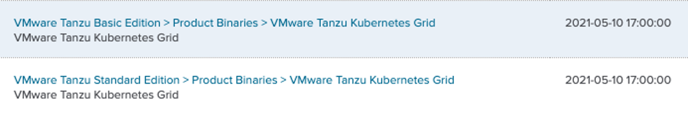
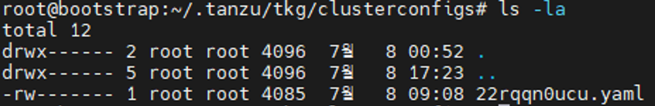

## 워크로드 클러스터 배포
### 개요 및 개념
#### 워크로드 클러스터

TKG 환경에서의 워크로드 클러스터는 Tanzu Kubernetes Cluster(TKC)라고
명칭합니다.

### 워크로드 클러스터 배포 방법

#### 클러스터 이미지 준비

    해당 과정은 관리 클러스터의 이미지를 준비하는 것과 거의 동일하며,
    버전 선택 등의 일부 사항에 대해서 워크로드에 맞는 변경사항을 적용이 필요합니다.

(1) 워크로드 클러스터의 이미지 파일을 다운로드하기 위해, VMware Customer
    Connect에 접속하여 로그인 합니다.\
    다음 링크를 참조합니다. (<https://my.vmware.com>)

(2) VMware Customer Connect에서 제품 검색을 통해 TKG를 검색합니다.
    홈페이지 상단의 "Products and Accounts" 탭에 마우스를 올려 메뉴를
    확장합니다. "All Products"를 클릭하여 제품 목록으로 이동합니다.

(3) 제품 목록 페이지 상단의 검색창에 다운로드 하고자 하는 제품의 이름을
    입력합니다. 본 매뉴얼의 예시에서는 "tanzu Kubernetes grid 1.3"을
    다운로드 하고자 하므로 해당 검색어를 넣고 검색창 우측의 돋보기
    모양을 클릭하여 검색합니다.

(4) 검색 결과에서 관련 제품이 모두 반환되기 때문에 다운로드 하고자 하는
    제품과 정확하게 일치하는 Product Binary 항목을 확인합니다. 위
    이미지와 같이 TKG의 경우, Tanzu Kubernetes Grid라는 명칭과 일치하는
    항목을 먼저 확인 후, 활용하고자 하는 라이선스 에디션을 선택해야
    합니다.\
    다운로드 하고자 하는 제품의 항목이 있는 지 확인 후, 클릭하여
    다운로드 페이지로 이동합니다.

(5) TKG를 다운로드 받을 수 있는 페이지로 이동 후, 버전에 맞는 TKG를 선택
    합니다.

(6) 관리 클러스터는 취약점이 개선된 가장 최신의 버전의 이미지로
    다운로드하며, 워크로드 클러스터는 관리 클러스터 이하의 버전으로 모두
    설치 가능하므로, 사용 워크로드에 맞춰 버전을 다운로드 합니다. 또한,
    관리 클러스터와 마찬가지로 사전 요구사항에 필요한 Tanzu CLI, kubectl
    등의 파일도 함께 다운로드 받습니다.

    클러스터 이미지로 photon OS 기반과 Ubuntu 기반 모두 지원하나,
    일반적으로 새로운 쿠버네티스 버전 및 취약점 개선 패치에 대하여,
    Photon OS에 대한 이미지를 먼저 지원한 후 Ubuntu를 지원하는 것을 참조하여 선택합니다.

참조 :
<https://docs.vmware.com/en/VMware-Tanzu-Kubernetes-Grid/1.3/vmware-tanzu-kubernetes-grid-13/GUID-install-cli.html>

(7) 다운로드 받은 이미지 파일을 부트스트랩 머신에서 확인할 수 있도록
    업로드 합니다.

#### 워크로드 클러스터 배포

(1) 앞선 챕터를 통해 Tanzu CLI가 설치되고 TKG 관리자로 접속이 되었는지
    확인합니다. 추후 여러 개의 클러스터가 생성되므로, 현재 접속된
    클러스터의 컨텍스트를 확인하는 것이 중요합니다. 다른 클러스터에
    접속되어 있는 것을 확인한 경우, 컨텍스트를 변경하여 관리 클러스터로
    접속할 수 있도록 합니다.

tanzu cluster list

(2) Tanzu CLI 명령어로 배포된 클러스터가 있는지 확인합니다. 이때, 사전에
    배포된 관리클러스터는 확인되지 않습니다.\
    아직 워크로드 클러스터가 배포되지 않았으므로, 클러스터의 목록이
    반환되지 않습니다.

tanzu cluster list --include-management-cluster

> (2-1) 관리 클러스터의 목록을 함께 확인하기 위해서는 위 명령어를
> 수행합니다.

(3) 관리 클러스터의 배포 과정과 마찬가지로 워크로드 클러스터를 배포하기
    위한 yaml 파일을 생성합니다. 배포하고자 하는 워크로드 클러스터의
    이름과 구성 값(노드 갯수, 대표 ip 등)을 결정하여 yaml 파일에
    입력합니다.\
    아래 공식 문서에서 예시 yaml 파일을 확인하실 수 있습니다.\
    (<https://docs.vmware.com/en/VMware-Tanzu-Kubernetes-Grid/1.3/vmware-tanzu-kubernetes-grid-13/GUID-tanzu-k8s-clusters-vsphere.html>)\
    또는, 관리 클러스터 배포 과정에서 임의로 생성된 yaml 파일을 복제하여
    구성값을 변경하는 방식으로 활용할 수도 있습니다.\
    \
    

> (3-1) 다음 위치 \~/.tanzu/tkg/clusterconfigs/ 로 이동하여 생성된 yaml
> 파일을 사용하고자 하는 위치로 복제합니다. 자동 생성되는 yaml 파일은
> 무작위로 이름이 지정됩니다. 복제된 파일을 편집기로 수정하여 워크로드
> 클러스터 yaml 파일을 만듭니다. 이때 VSPHERE_CONTROL_PLANE_ENDPOINT는
> 충돌나지 않게 새로이 할당합니다.\
> (<https://docs.vmware.com/en/VMware-Tanzu-Kubernetes-Grid/1.3/vmware-tanzu-kubernetes-grid-13/GUID-tanzu-k8s-clusters-deploy.html>)

tanzu kubernetes-release get

(4) 이때, 관리 클러스터와 다른 버전의 쿠버네티스 릴리즈 이미지를
    배포하려고 한다면, 호환 가능한 클러스터의 쿠버네티스 릴리즈 버전을
    확인하여 yaml 파일에 기입하거나 생성 시 명시적으로 명령어에 표시해야
    합니다. 위 명령어를 통해 호환 가능한 쿠버네티스 릴리즈 버전을
    확인합니다.

tanzu cluster create \[워크로드 클러스터 이름\] -tkr \[쿠버네티스 릴리즈
이름\]

(5) 위 명령어와 같이 배포하고자 하는 쿠버네티스 릴리즈 버전을 명시하여
    실제 배포 시 해당 릴리즈 버전의 쿠버네티스 이미지의 템플릿을
    사용하도록 합니다.\
    다음 링크를 통해 공식문서에서 추가적인 내용을 확인할 수 있습니다.
    (<https://docs.vmware.com/en/VMware-Tanzu-Kubernetes-Grid/1.3/vmware-tanzu-kubernetes-grid-13/GUID-tanzu-k8s-clusters-k8s-versions.html>)

tanzu create \[워크로드 클러스터 이름\] --file \[(3)에서 생성한
yaml파일\]

(6) 생성된 파일을 확인 후, Tanzu CLI 명령어를 실행하여 워크로드
    클러스터를 배포합니다. 위 명령어는 기본적인 생성을 위한 명령어이고\
    tanzu create \[워크로드 클러스터 이름\] --file \[(3)에서 생성한
    yaml파일\] -v 9\
    본 매뉴얼의 예시에서는 위와 같이 디버깅을 위한 플래그를 별도로
    표기하였습니다.

tanzu cluster list

(7) 위 명령어를 통해 클러스터의 생성 상태를 확인하고, 생성 완료를 대기한
    후, 생성된 클러스터를 확인합니다.

#### 워크로드 클러스터 관리자 권한 획득

(1) 현재 kubernetes가 가지고 있는 context를 확인합니다. 본 매뉴얼의 예시
    기준으로, 관리 클러스터인 tkg-mgmt 클러스터를 바라보고 있는 관리자
    권한을 가지고 있는 것을 확인할 수 있습니다. 현재 Tanzu CLI 환경에서
    새로 배포한 워크로드 클러스터의 관리자 권한이 등록되지 않은 것으로
    관찰할 수 있는 상태입니다.

tanzu cluster kubeconfig get \[워크로드 클러스터 이름\] \--admin

(2) Tanzu CLI를 활용하여 워크로드 클러스터의 관리자 권한을 가져옵니다.
    위 명령어를 실행합니다. 해당 워크로드 클러스터의 접속 정보가 저장된
    것을 알 수 있습니다.

kubectl config use-context \[컨텍스트 이름\]

kubectl config get-contexts

(3) 위 명령어를 통해 컨텍스트 스위치를 하여 해당 클러스터 관리자로
    접속한 것을 확인합니다.

(4) 워크로드 클러스터의 네임스페이스를 확인하여 실제 스위치가 이루어진
    것을 확인 합니다.

참조 :
<https://docs.vmware.com/en/VMware-Tanzu-Kubernetes-Grid/1.3/vmware-tanzu-kubernetes-grid-13/GUID-tanzu-k8s-clusters-index.html>

