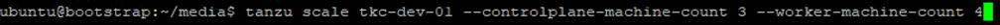
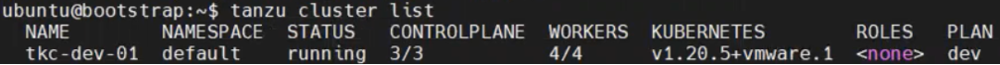

## 워크로드 클러스터 스케일링
### 개요 및 개념
#### 워크로드 클러스터 스케일링

워크로드 클러스터를 스케일링 한다는 것은 클러스터 내부의 노드 개수를
새로 지정하여 배포하는 것을 의미합니다. 워크로드 클러스터 스케일링은
명령어를 통해 바로 수행할 수 있습니다.

### 스케일링 방법

tanzu cluster scale \[클러스터 이름\] \--controlplane-machine-count
\[관리 노드 개수\] \--worker-machine-count \[워커 노드 개수\]

(1) 위 명령어를 입력합니다. Tanzu CLI 명령어로 클러스터의 이름과
    스케일링 하고자 하는 노드의 개수를 각각 표기합니다.

> 

(2) 위 명령어를 입력하여 현재 클러스터 내부의 노드 개수가 업데이트 되고
    신규로 배포되는 것을 확인 합니다.
