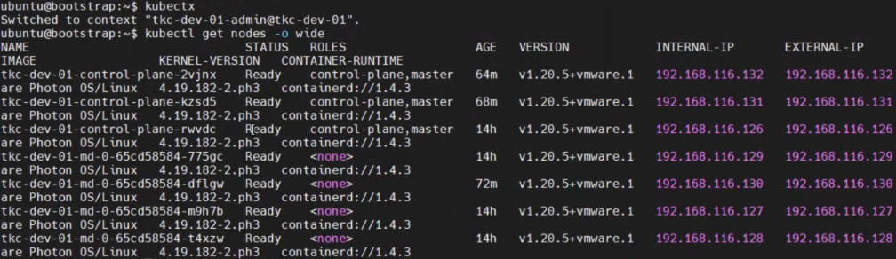

## 워크로드 클러스터 업그레이드
### 개요 및 개념
#### TKC 쿠버네티스 릴리즈

VMware Tanzu Kubernetes Grid는 여러 쿠버네티스 릴리즈 버전에 대한 지원을
제공합니다. 기본적으로는 최신 릴리즈로부터 3개 버전까지 지원이 되며,
실제 지원 가능한 릴리즈 버전 이미지에 대해서는 Tanzu CLI 등을 활용하여
지원 및 호환 가능 여부에 대해서 확인이 필요합니다.

실제 업그레이드 적용 시, 쿠버네티스의 기본값에 따라 롤링 업데이트
(rolling update)를 진행하는 것을 관찰할 수 있습니다.

### 업그레이드 방법
#### 이전 버전의 워크로드 클러스터 배포

    배포하고자 하는 쿠버네티스 릴리즈 버전의 클러스터
    이미지가 미리 준비되어야 합니다.

(1) 배포하고자 하는 워크로드 클러스터의 구성값을 yaml 파일을 통해
    지정합니다. 새로운 이름과 대표 IP, 그리고 구성 노드에 대한 정보를
    기입합니다.

tanzu cluster create \[워크로드 클러스터 이름\] --file \[워크로드
클러스터 yaml 파일\] --tkr \[배포 쿠버네티스 릴리즈 이름\]

(2) 위 명령어를 입력하여 yaml 파일 기반의 클러스터 배포를 실행합니다.
    이때, "\--tkr" 명령어를 통해 쿠버네이스 릴리즈 버전을 명시하며,
    인식되는 릴리즈 이름은 tanzu kubernetes-release get 명령어를 통해
    확인할 수 있습니다.\
    본 매뉴얼의 예시에서는 1.19.8\-\--vmware.3-tkg.1 이라는 릴리즈
    버전을 활용합니다.

tanzu cluster list

(3) 위 명령어를 입력하여 워크로드 클러스터 리스트를 확인합니다. 현재
    낮은 버전(1.19.8+vmware.3)의 워크로드 클러스터가 생성중인 것을
    확인할 수 있습니다.

kubectx

kubectl get nodes -o wide

(4) 생성중인 클러스터로 컨텍스트를 변경하여 접속 후, 소속 노드에 대한
    정보를 확인합니다. 각 노드에 IP가 할당되는 것을 확인합니다. 대표
    IP가 관리 노드 중 하나에 할당된 것을 관찰할 수 있습니다.

#### 업그레이드 수행

kubectl config use-context \[워크로드 클러스터 컨텍스트\]

(1) 업그레이드를 수행하고자 하는 클러스터에 접속한 것을 확인합니다.

tanzu cluster upgrade \[클러스터 이름\]

(2) 위 명령어를 입력하여 업그레이드를 수행합니다.

(3) 클러스터의 관리자 노드 부터 업그레이드가 진행되고 있는 것을 확인할
    수 있습니다. 해당 과정은 시간이 많이 소요될 수 있습니다.

(4) 이어서 작업자 노드의 업그레이드가 진행되는 것을 알 수 있습니다.

(5) vCenter 작업 목록을 통해 노드가 하나씩 종료 및 재시작하며 롤링
    업데이트 방식으로 업그레이드가 진행되고 있는 것을 확인할 수
    있습니다.

(6) 업그레이드가 완료된 것을 확인합니다.
