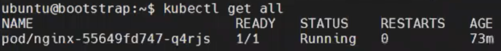
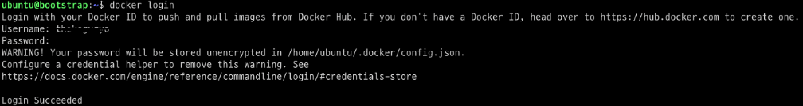

# 애플리케이션 배포
## 샘플 애플리케이션 배포 : nginx
### 샘플 애플리케이션 준비

(1) 앞선 챕터를 따라 배포된 워크로드 클러스터에 접속하여 애플리케이션
    pod를 배포합니다.

(2) Docker hub상의 이미지를 배포하는 사용량 제한으로 문제가 발생하는
    경우가 있습니다. 아래를 참고하여, imagepullsecret을 사전에 생성하여
    배포합니다.\
    - docker login\
    

> \- secret 생성

kubectl create secret generic dockerhub-regcred \\

\--from-file=.dockerconfigjson=/home/ubuntu/.docker/config.json \\

\--type=kubernetes.io/dockerconfigjson

> \- nginx-deployment.yaml

apiVersion: apps/v1

kind: Deployment

metadata:

name: nginx

spec:

selector:

matchLabels:

app: nginx

replicas: 1

template:

metadata:

labels:

app: nginx

spec:

containers:

\- name: nginx

image: nginx:latest

ports:

\- containerPort: 80

**imagePullSecrets:**

**- name: dockerhub-regcred**

> \- 배포

kubectl apply -f nginx-deployment

(3) 본 매뉴얼의 예시로는 nginx를 애플리케이션 파드 형태로
    배포하였습니다.
