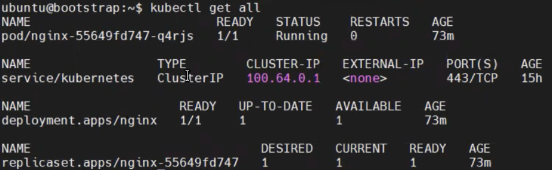
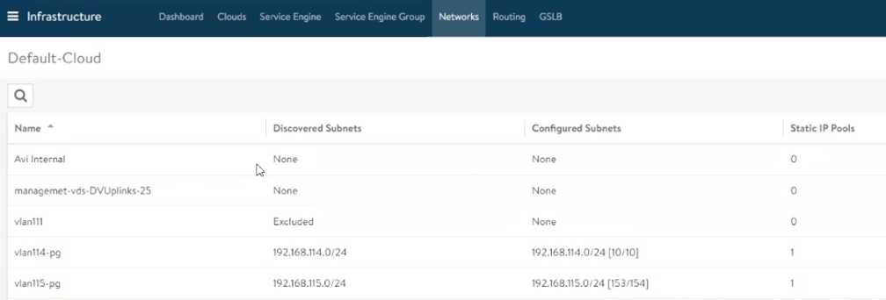
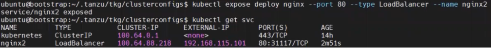
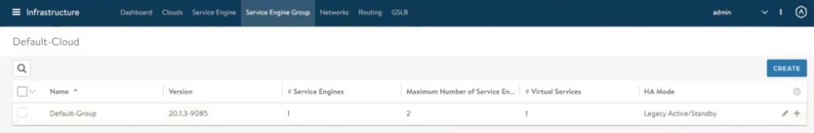
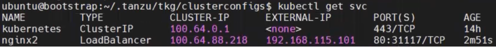
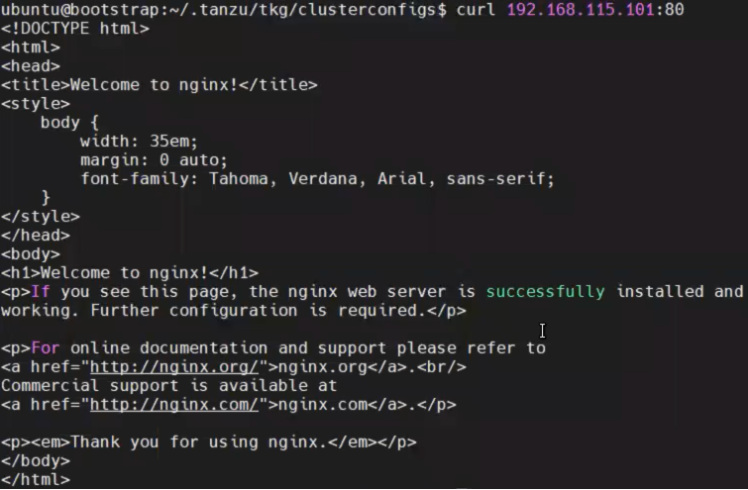
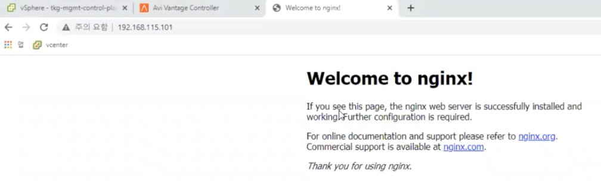

## 샘플 애플리케이션 Expose
### 개요 및 개념
#### Expose

Kubernetes 환경에서 실제로 동작중인 애플리케이션에 접근하기 위해 서비스
오브젝트 등을 활용하여 외부 IP를 노출하도록 하는 작업입니다.

### Load Balancer Expose

AVI 로드 밸런서를 활용하는 경우, 서비스를 AVI로 expose하여 외부 IP를
받을 수 있도록 합니다.

(1) 애플리케이션이 배포된 클러스터에 접속하여 모든 리소스의 목록을
    확인합니다. 애플리케이션이 실행되고 있는 파드와 함께 배포된 서비스를
    확인합니다. 서비스 목록을 확인했을 때 애플리케이션의 외부 통신을
    가능하게 하는 서비스가 없는 것을 관찰할 수 있습니다.

(2) 사전에 배포한 AVI 관리 페이지에서 메인 메뉴 \> Infrastructure \>
    네트워크 탭으로 이동합니다.

(3) 해당 화면에서 현재 사용중인 네트워크 정보를 확인할 수 있습니다.\
    본 매뉴얼의 예시에서 워크로드 클러스터가 배포되어 있는 네트워크
    영역은 vlan115-pg로, 192.168.115.x 대역을 사용하고 있습니다. 추후
    할당 받는 IP의 대역과 비교하여 올바르게 expose 되었는지 확인 합니다.

(4) 위 kubectl 명령어를 통해 배포한 애플리케이션의 포트를 로드밸런서
    서비스로 expose합니다. 이때, 해당 쿠버네티스 환경은 워크로드
    클러스터로 배포한 TKC 환경으로, AVI를 사용하기 때문에 TKG를 통해 AVI
    서비스 엔진을 로드 밸런서 서비스로 생성하여 제공하게 됩니다. 본
    매뉴얼의 예시에서는 포트 번호를 80으로 할당하였습니다.

(5) AVI 관리 페이지에서 서비스 엔진이 배포되는 것을 확인합니다.

(6) 배포된 AVI 로드 밸런서가 쿠버네티스 로드 밸런서 서비스에 외부 IP를
    할당한 것을 확인할 수 있습니다. 본 매뉴얼의 예시의 경우, 실제 포트
    번호는 31117번으로 할당된 것을 확인할 수 있습니다. 단, AVI 서비스
    엔진의 대표 IP와 지정한 포트번호 80번으로 트래픽을 받아서 전달하기
    때문에 실제 접속 시 해당 포트 번호를 입력하지 않아도 통신이
    가능합니다.

curl \[할당받은 외부 IP\]:\[서비스 포트 번호\]

(7) 위의 명령어를 입력하여 할당된 외부 IP와 서비스 포트 번호를 통해
    애플리케이션 접속이 가능한지 확인합니다.

(8) 브라우저 주소창에 "http://\[애플리케이션 외부IP\]"를 입력하여 실제로
    브라우저를 통해 해당 IP에 접속할 수 있는 것을 확인합니다. 브라우저를
    통한 접속 시에도 지정된 포트 번호 없이 IP주소만으로 포워딩 되는 것을
    확인할 수 있습니다.
