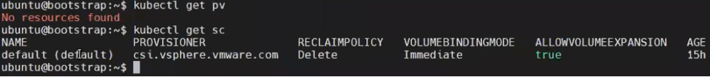
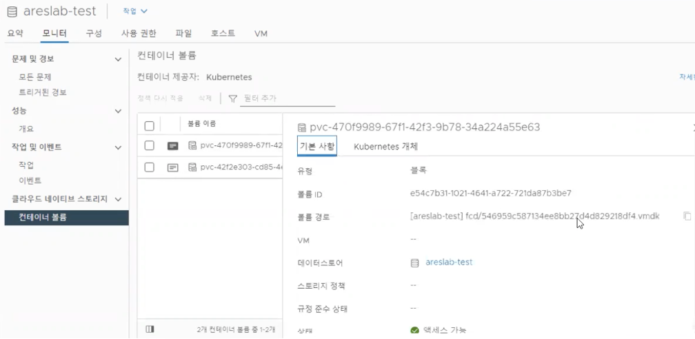

## Persistent Volume
### PV 추가 

kubectl get sc

(1) 쿠버네티스 환경에서 storage class를 확인합니다. 최초로 TKG를
    배포했을 때 선택한 데이터스토어에 대해 기본적으로 구성되어 있는 것을
    확인할 수 있습니다. 별도의 변경 사항 없이 PV를 생성하게 되는 경우,
    해당 데이터스토어 저장됩니다.

(2) PV 추가는 일반 쿠버네티스 환경에서의 추가 방식과 동일합니다.

(3) 애플리케이션에 PV를 추가한 후 실제 vCenter Server UI상에서도
    데이터스토어에 등록된 PV를 확인할 수 있습니다.
