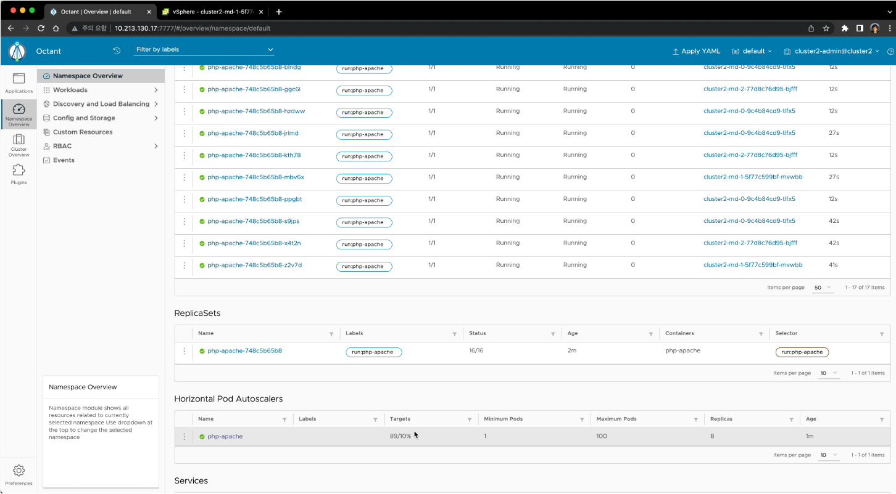
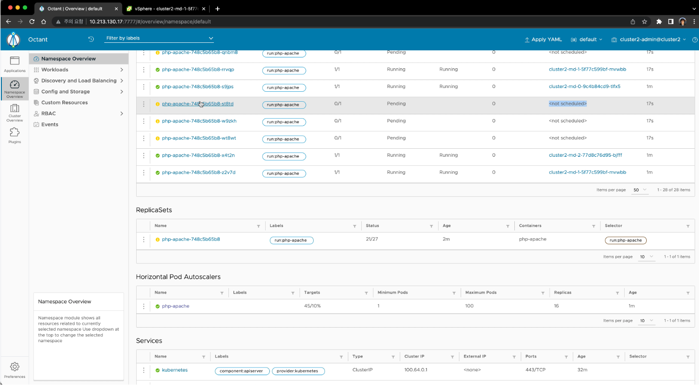
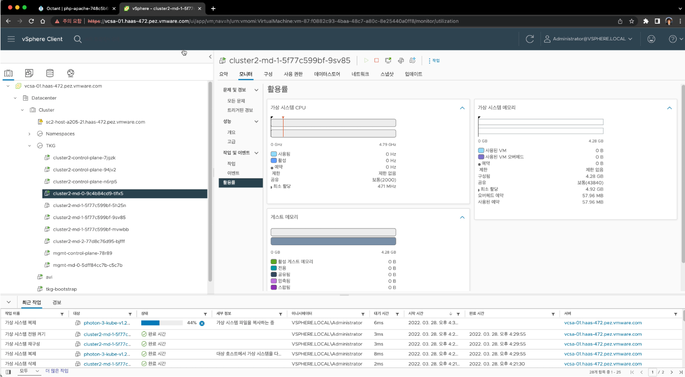
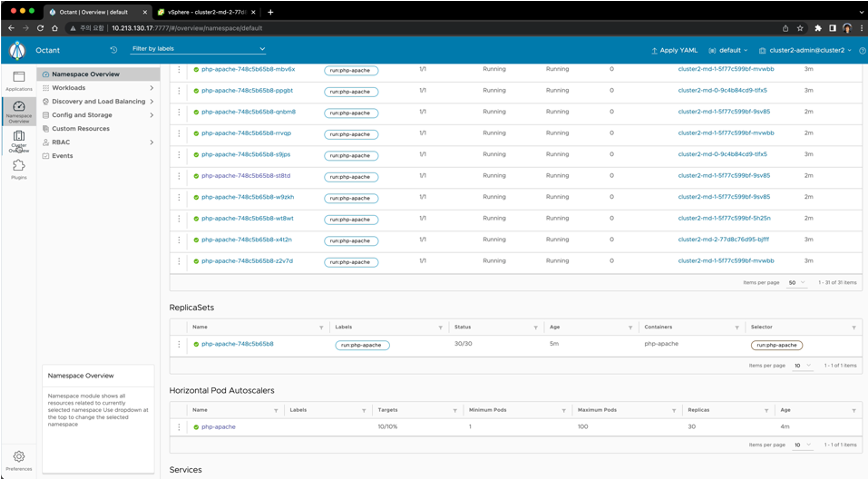
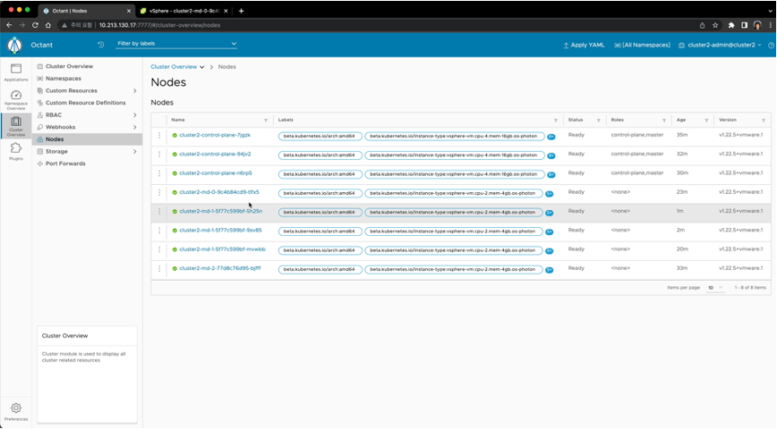

# Node Auto Scale
Node Auto Scale 기능은 Cluster에서 Node(Machine)의 상태를 모니터링하고 있다가 리소스가 부족하여 Schedule을 하지 못하는 상태가 발생했을 경우 Node를 자동으로 증가시켜주는 기능입니다.

이 기능은 Cluster 생성시에 정보를 입력해야 합니다. Cluster를 새로 생성하는 과정부터 진행해보도록 하겠습니다.
기존 cluster 생성하는 yaml 파일에 아래의 내용을 넣은 후에 새로운 파일로 생성합니다.

## Cluster 생성 (auto scale 활성화)
```
cd ~/.tanzu/tkg/clusterconfig
cp xxx.yaml cluster2.yaml
```
새로 생성한 cluster2.yaml 파일에서 VSPHERE_CONTROL_PLANE_ENDPOINT 와 CLUSTER_NAME을 수정합니다.

```
...
VSPHERE_USERNAME: administrator@vsphere.local
VSPHERE_WORKER_DISK_GIB: "40"
VSPHERE_WORKER_MEM_MIB: "4384"
VSPHERE_WORKER_NUM_CPUS: "2"

...
ENABLE_AUTOSCALER: true
AUTOSCALER_MAX_NODES_TOTAL: "20"
AUTOSCALER_SCALE_DOWN_DELAY_AFTER_ADD: "10m"
AUTOSCALER_SCALE_DOWN_DELAY_AFTER_DELETE: "10s"
AUTOSCALER_SCALE_DOWN_DELAY_AFTER_FAILURE: "3m"
AUTOSCALER_SCALE_DOWN_UNNEEDED_TIME: "10m"
AUTOSCALER_MAX_NODE_PROVISION_TIME: "15m"
AUTOSCALER_MIN_SIZE_0: "1"
AUTOSCALER_MAX_SIZE_0: "5"
AUTOSCALER_MIN_SIZE_1: "1"
AUTOSCALER_MAX_SIZE_1: "5"
AUTOSCALER_MIN_SIZE_2: "1"
AUTOSCALER_MAX_SIZE_2: "5
```

아래의 명령어를 실행해서 클러스터를 생로 생성합니다.

```
tanzu create cluster --file cluster2.yaml 
```

## Auto Scaling 기능 확인
Auto Scaling이 정상적으로 잘 되는지 확인을 해보도록 하겠습니다.
먼저 현재 생성된 worker node의 수를 vCenter 에서 확인합니다.

1. kubectl get nodes 명령어로 현재 cluster의 worker nodes수를 확인합니다.
아래는 control plane 3개, worker node 3개가 만들어진 상태입니다.

```
kubectl get nodes
NAME                             STATUS   ROLES                  AGE    VERSION
cluster2-control-plane-7jgzk     Ready    control-plane,master   127m   v1.22.5+vmware.1
cluster2-control-plane-94jv2     Ready    control-plane,master   124m   v1.22.5+vmware.1
cluster2-control-plane-n6rp5     Ready    control-plane,master   122m   v1.22.5+vmware.1
cluster2-md-0-9c4b84cd9-tlfx5    Ready    <none>                 114m   v1.22.5+vmware.1
cluster2-md-1-5f77c599bf-5h25n   Ready    <none>                 93m    v1.22.5+vmware.1
cluster2-md-2-77d8c76d95-bjfff   Ready    <none>                 125m   v1.22.5+vmware.1
```

2. application 배포
아래의 내용으로 php/apache 프로그램을 배포할 예정입니다.
php.yaml 파일을 만들고 아래의 내용을 복사해서 붙여넣기 합니다.

```
apiVersion: apps/v1
kind: Deployment
metadata:
  name: php-apache
spec:
  selector:
    matchLabels:
      run: php-apache
  replicas: 1
  template:
    metadata:
      labels:
        run: php-apache
    spec:
      containers:
      - name: php-apache
        image: k8s.gcr.io/hpa-example
        ports:
        - containerPort: 80
        resources:
          limits:
            cpu: 500m
            memory: "500Mi"
          requests:
            memory: "500Mi"
            cpu: 200m
---
apiVersion: v1
kind: Service
metadata:
  name: php-apache
  labels:
    run: php-apache
spec:
  ports:
  - port: 80
  selector:
    run: php-apache
```

실행을 해서 deployment를 생성합니다.

```
kubectl apply -f php.yaml
```

3. (HPA) auto scaler 설정
```
kubectl autoscale deployment php-apache --cpu-percent=10 --min=1 --max=100
```

4. 부하 발생 프로그램 실행
```
kubectl run -i --tty load-generator --rm --image=projects.registry.vmware.com/cnr/busybox@sha256:74f634b1bc1bd74535d5209589734efbd44a25f4e2dc96d78784576a3eb5b335 --restart=Never -- /bin/sh -c "while sleep 0.01; do wget -q -O- http://php-apache; done"
```

5. Node 증가 확인
kubectl get pods 를 실행 해서 node가 증가되는 것을 확인합니다.
1분 정도 시간이 지나면서 pending이 되게 됩니다. 이때 event가 발생해서 node가 증가하게 됩니다.
kubectl get nodes 를 실행해서 node 개수가 증가하는 것을 확인합니다.

## octant(GUI) 로 확인
kubectl 로 확인하는 것 이외에 GUI Console인 octant로 결과를 다음과 같이 확인하실 수 있습니다.
참고: octant 설치 (https://octant.dev/) 

1. HPA(pod auto scale) 기능에 의해 부하시 pod가 자동 증가하는 상태 확인


2. 리소스 부족으로 POD생성이 중단되고 Pending되는 상태 확인


3. vCenter 화면에서 이벤트 triggering에 의해 자동으로 Node가 새로 생성되는 상태 확인


4. HPA(Horizontal Pod Autoscaler)의 target으로 설정한 CPU 10%를 유지하고 있어 더이상 증가하지 않는 상태 확인


5. Worker Node가 5개로 증가한 상태 확인


수고하셨습니다.
이번 Lab을 정상적으로 완료하셨습니다.
