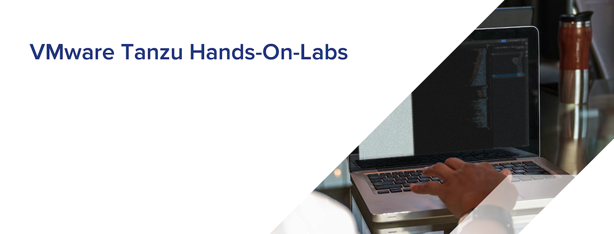

# TKGm-HOL
 (VMware Tanzu Kubernetes Grid - vSphere with Tanzu(TKGm) Hands-On-Lab)
 

## Required Artifacts
* 인터넷 접속 가능한 PC
* vSphere 7 with Tanzu
* SSH Terminal (windows Putty, macOS Terminal 등

## Courses
1. [Tanzu 및 TKG 소개](tkgm/0.introduction/)
1. [TKGm 플랫폼 배포 및 설정](tkgm/1.TKGm-setting/)
1. [Cluster 관리](tkgm/2.cluster-management/)
1. [애플리케이션 배포](tkgm/3.application-deployment/)
